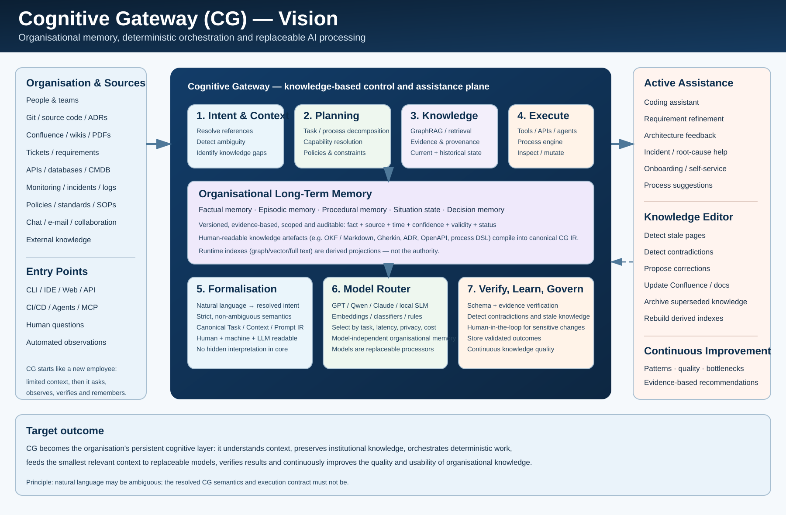
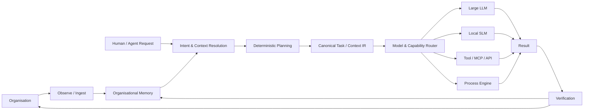
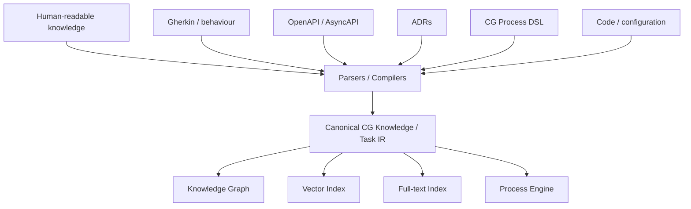
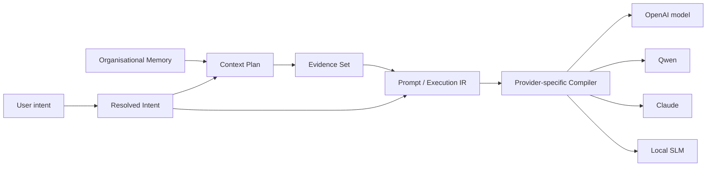

# 0. Vision

> **Vision statement**
>
> Cognitive Gateway shall evolve from a deterministic AI context and agent control plane into a persistent organisational cognitive layer: a system that understands organisational context, accumulates evidence-backed long-term knowledge, resolves natural-language intent into unambiguous execution semantics, routes work to replaceable models and tools, and continuously improves the quality, consistency and accessibility of organisational knowledge.



## 0.1 Why Cognitive Gateway exists

Organisations already possess the information needed to answer many day-to-day questions, implement software correctly, explain architectural decisions, improve processes and onboard new employees. The problem is that this knowledge is fragmented across source code, repositories, tickets, documentation platforms, monitoring systems, APIs, databases, conversations and individual employees.

Traditional AI assistants solve only part of this problem. They usually receive a prompt plus a limited context window and then attempt to produce a useful answer. The quality of the answer therefore depends heavily on which information happens to be present at that moment. Long-running organisational context, historical decisions, unresolved problems, operational state and company-specific conventions are easily lost.

Cognitive Gateway aims to introduce a stable layer between the organisation and replaceable AI execution runtimes.

The long-term goal is not to create another foundation model. The goal is to create an organisational memory and deterministic control plane that can supply any suitable model, agent or tool with the smallest relevant, validated and explainable context required for a task.

The model may change. The organisational knowledge must remain.

## 0.2 The guiding metaphor: a new employee who becomes experienced

The intended behaviour of Cognitive Gateway can be understood through the lifecycle of a new employee.

On the first day, the employee has general professional knowledge but limited knowledge about the company. The employee does not yet know internal terminology, ownership boundaries, historical decisions, local conventions, technical dependencies or recurring organisational problems.

The employee therefore asks experienced colleagues, reads documentation, examines systems, observes processes and gradually builds a mental model of the organisation.

Over time the employee becomes useful because less context has to be repeated. A statement such as “that service is still too slow” may become sufficient because the employee already knows:

- which service is currently being discussed;
- what the last measured latency was;
- which target was agreed;
- which optimisation was already attempted;
- which dependencies the service has;
- which incident, ticket or requirement led to the current work;
- which information is verified and which remains uncertain.

Cognitive Gateway shall reproduce this principle in a controlled and auditable form.

It shall not merely retain chat history. It shall build structured organisational knowledge from validated observations and evidence.

## 0.3 The architectural destination

At the highest level, Cognitive Gateway shall connect four worlds:

1. **The organisation** — people, systems, code, documents, processes and operational signals.
2. **Organisational memory** — structured, versioned and evidence-backed knowledge.
3. **Deterministic cognition and orchestration** — intent resolution, planning, policy, capability resolution and process execution.
4. **Replaceable cognitive processors** — LLMs, SLMs, classifiers, embedding models, rules engines and specialised tools.

The long-term architecture therefore follows this conceptual flow:



The system should become increasingly useful because validated outcomes and observations enrich the organisational memory.

This creates a feedback loop:

```text
observe
  -> understand
  -> resolve
  -> act
  -> verify
  -> remember
  -> improve
  -> observe ...
```

## 0.4 Current foundation and future direction

The current architecture already establishes important foundations for this vision:

- a deterministic Rust core;
- versioned domain concepts and `ExecutionContextIR`;
- project-independent Agent, Skill and Capability catalogs;
- deterministic capability and workflow resolution;
- explicit policy and authority boundaries;
- a process engine and formal process representation;
- read-only inspectability through CLI boundaries;
- explicit knowledge, capability, evidence and runtime ports;
- replaceable execution runtimes;
- progressive retrieval as an external cognitive service rather than authority;
- strict separation between project context and canonical catalog definitions.

These foundations are intentionally model-independent.

The future vision extends them with richer knowledge ingestion, GraphRAG, long-term organisational memory, semantic language layers, context-sensitive intent resolution, model routing, verification, knowledge curation and continuous organisational improvement.

This document describes the destination. It does not imply that every element shown in the vision overview is implemented today.

## 0.5 Organisational long-term memory

The core long-term differentiator of Cognitive Gateway shall be persistent organisational memory.

This memory must not be implemented as an opaque accumulation of conversation transcripts. It should contain structured knowledge with explicit provenance, validity and lifecycle information.

At minimum, the vision distinguishes five complementary memory classes.

### Factual memory

Factual memory represents relatively stable organisational facts.

Examples:

- Service X uses PostgreSQL.
- Team Billing owns Service X.
- Repository Y contains the deployment definition.
- Capability Z requires a specific permission.

### Episodic memory

Episodic memory represents events and observations over time.

Examples:

- a production incident occurred;
- a latency regression was detected;
- a deployment failed;
- a migration was completed;
- a previous optimisation reduced p95 latency.

### Procedural memory

Procedural memory captures how work is expected to be performed.

Examples:

- production deployment requires approval;
- architecture changes require an ADR;
- a release must pass specific quality gates;
- a requirement must contain defined acceptance criteria.

### Situational memory

Situational memory captures the current working state.

Examples:

- Service X is the current focus;
- performance remains an open problem;
- the latest measured p95 latency is 430 ms;
- the desired target is 300 ms;
- database query optimisation has already been attempted.

This enables short follow-up statements such as “it is still too slow” to be resolved into a precise task without repeatedly asking for context that is already known.

### Decision memory

Decision memory preserves why the organisation made a choice.

Examples:

- why RabbitMQ was selected;
- why Kafka was rejected at a specific point in time;
- why a service boundary exists;
- why a policy or architectural rule was introduced.

This protects institutional knowledge against employee turnover and the loss of historical context.

## 0.6 Evidence before memory

Cognitive Gateway should not treat every generated statement as organisational truth.

Knowledge should become persistent only through an explicit evidence and validation lifecycle.

A persisted knowledge statement should be able to carry concepts such as:

```text
subject
predicate
object / value
source
observed_at
valid_from
valid_until
confidence
scope
verification_status
lifecycle_status
```

The goal is not “the AI remembers everything”.

The goal is:

> Cognitive Gateway accumulates verifiable organisational knowledge.

Contradictory facts, weakly supported observations and model-generated hypotheses must remain distinguishable from verified knowledge.

## 0.7 Human-readable knowledge as a first-class requirement

The organisational memory should not exist only inside a vector database or graph database.

Human-readable and versionable source artefacts are strategically important.

Potential knowledge artefacts include:

- Markdown and Open Knowledge Format style documents;
- Gherkin for behaviour and acceptance semantics;
- Architecture Decision Records;
- OpenAPI and AsyncAPI definitions;
- JSON Schema;
- source code and configuration;
- process DSL documents;
- policies and standards.

These artefacts may use different surface syntaxes because they serve different domains.

The unifying layer is the canonical Cognitive Gateway intermediate representation.



Graph, vector and search databases are therefore derived runtime projections. They optimise retrieval; they do not become the sole source of organisational truth.

## 0.8 GraphRAG as relationship-aware organisational retrieval

GraphRAG fits the vision because organisational knowledge is inherently relational.

A useful organisational assistant must understand not only documents, but relationships such as:

- service depends on database;
- team owns service;
- capability requires permission;
- process invokes capability;
- requirement affects component;
- decision supersedes decision;
- incident relates to deployment;
- observation supports finding;
- finding remains unresolved.

Graph retrieval can combine these relationships with semantic and lexical retrieval.

The intended retrieval strategy is hybrid:

```text
structured knowledge
        |
        +--> graph traversal
        +--> vector similarity
        +--> full-text search
        +--> metadata filtering
        +--> evidence history
        |
        v
context planner
```

Retrieval remains subordinate to policy, provenance and deterministic context construction.

## 0.9 Natural language at the boundary, unambiguous semantics inside

Humans should be allowed to communicate naturally.

Natural language is inherently incomplete and ambiguous. That ambiguity is acceptable at the system boundary.

It is not acceptable inside the formal execution contract.

The design principle is:

> Natural language may express intent. Resolved Cognitive Gateway semantics must express unambiguous meaning.

A request may begin as:

```text
"The service is still too slow."
```

The gateway may use active conversation context, situational memory and organisational knowledge to resolve this into:

```yaml
task:
  type: performance_analysis

target:
  service: ServiceX

current_state:
  p95_latency: 430ms

desired_state:
  p95_latency_max: 300ms

previous_actions:
  - database_query_optimization

goal:
  identify_remaining_latency_causes
```

If the target cannot be resolved uniquely, the system must retain the ambiguity and request clarification rather than silently guess.

The long-term language architecture therefore separates:

- natural-language intent;
- contextual resolution;
- strict semantic representation;
- canonical IR;
- provider-specific prompt or execution rendering.

## 0.10 A formal language for humans, machines and language models

Cognitive Gateway is expected to require a formal semantic language family.

The objective is not to invent syntax for its own sake. The language exists to create a shared, explicit and parseable contract between humans, deterministic software and language models.

The desired properties are:

- human-readable;
- machine-parseable;
- easy for LLMs to generate and consume;
- deterministic;
- non-ambiguous after resolution;
- versionable;
- schema-validatable;
- independent of a specific model provider;
- explicit about inputs, outputs, evidence and constraints.

The semantic layer may contain concepts such as:

```text
role
goal
target
input
context
evidence
constraints
capabilities
process
output contract
verification
```

Surface syntax is secondary. The canonical meaning is primary.

A central acceptance principle for the eventual language is:

> Two independent conforming implementations must map the same valid formal expression to the same semantic IR.

## 0.11 Prompt compilation rather than prompt authoring

The user should not be responsible for constructing optimal model-specific prompts.

Cognitive Gateway should build a validated Prompt or Execution IR from resolved intent, relevant organisational context, evidence, policy and output contracts.

A model-specific adapter can then compile that representation into the format appropriate for the selected model.



This allows prompting strategies to evolve without changing organisational semantics.

Instruction, context and evidence must remain structurally separated so that retrieved content cannot silently become authority or instruction.

## 0.12 Replaceable models and task-dependent processing

Cognitive Gateway should not be coupled to a single LLM.

Different tasks may be performed by different cognitive processors.

Examples:

- deterministic parser for known syntax;
- rules engine for policy;
- embedding model for retrieval;
- small local model for classification;
- specialised model for entity extraction;
- large reasoning model for complex architecture analysis;
- tool or API for deterministic calculation;
- process engine for controlled multi-step execution.

The router should eventually be able to consider factors such as:

- required reasoning capability;
- latency;
- privacy;
- locality;
- cost;
- context size;
- tool support;
- structured-output support;
- reliability requirements.

The organisational memory and canonical task semantics remain stable while the selected processor can change.

## 0.13 Assistance across the organisation

The long-term assistant is not limited to a chat interface.

Potential interaction surfaces include IDEs, CLI clients, web applications, CI/CD, APIs, MCP clients and automated agents.

The same organisational memory can support multiple use cases.

### Software development

Cognitive Gateway may supply a coding model with company-specific architecture, coding rules, relevant ADRs, API conventions, dependencies, known defects and required tests.

A short request such as “add a cancellation endpoint” can therefore be enriched with the organisation-specific information required to implement the change consistently.

### Requirement engineering

Cognitive Gateway may identify missing decisions before a requirement reaches implementation.

For example:

- missing error behaviour;
- unclear authorisation;
- missing acceptance criteria;
- undefined lifecycle;
- contradiction with an existing requirement;
- conflict with an architecture decision.

It may then help transform clarified requirements into formal acceptance examples or other structured artefacts.

### Architecture and design

The system can relate implementation, documentation, dependencies, decisions and standards, allowing architecture feedback to be grounded in actual organisational evidence.

### Operations and incidents

Historical incidents, deployment state, monitoring data, known dependencies and previous remediation attempts can be combined into a richer diagnostic context.

### Onboarding and self-service

A new employee can ask organisational questions and receive answers grounded in the same curated knowledge base used by experienced teams.

## 0.14 The automatic knowledge editor

Cognitive Gateway should eventually become an active curator of organisational knowledge.

This role is intentionally separate from free autonomous mutation.

The knowledge editor may:

- observe changes in authoritative sources;
- detect stale documentation;
- detect contradictions between documentation and implementation;
- identify broken links and outdated versions;
- propose corrections;
- update low-risk generated or factual documentation;
- archive superseded knowledge;
- preserve historical decisions;
- trigger re-indexing of derived GraphRAG and vector representations.

A typical lifecycle is:

```text
active
  -> suspected_stale
  -> stale
  -> deprecated
  -> archived
  -> optionally deleted
```

Deletion should be exceptional because historical knowledge can remain valuable for audit, incident analysis and understanding why the current architecture exists.

Sensitive content should normally follow:

```text
observe -> propose -> review -> approve -> write
```

Low-risk mechanical updates may eventually be fully automated under explicit policy.

## 0.15 Confluence and other documentation systems become projections and sources

In the target architecture, Confluence, wikis and similar systems are not necessarily the only authority for knowledge.

They can act as both:

- knowledge sources observed by Cognitive Gateway; and
- publication targets updated from validated knowledge.

This enables a controlled feedback loop where implementation changes can reveal outdated documentation and validated knowledge changes can be published back into organisational systems.

The authoritative role of each source must remain explicit. Cognitive Gateway must never infer authority merely because information is retrievable.

## 0.16 Continuous organisational improvement

Once enough historical evidence is available, Cognitive Gateway may identify recurring organisational patterns.

Examples include:

- requirements repeatedly missing the same acceptance information;
- incidents correlated with manual configuration changes;
- recurring architecture violations;
- documentation that becomes stale after specific workflows;
- process steps that create repeated delays;
- quality gates that catch the same class of defect late.

The gateway may use this evidence to propose process improvements.

The important distinction is that proposals should be explainable.

A useful recommendation is not:

```text
"This process is bad."
```

It is closer to:

```text
"37 requirements in the last six months required follow-up because
authorisation and failure behaviour were not defined. Consider adding
those fields to the requirement template."
```

This converts organisational memory into measurable organisational learning.

## 0.17 Governance, security and authority

A system that accumulates broad organisational knowledge must have stricter governance than a normal chatbot.

The vision therefore retains the existing deterministic-first principles.

Knowledge retrieval must never imply permission to act.

Important architectural boundaries include:

- knowledge is not authority;
- retrieval is not capability permission;
- model output is not verified fact;
- memory insertion is not automatic trust;
- mutation requires an explicit capability;
- sensitive mutation may require human approval;
- provenance and audit evidence must remain inspectable;
- project runtime context may not silently mutate canonical catalogs;
- probabilistic services may advise but must not bypass deterministic policy.

Role-based or attribute-based access, data classification and source-level permissions will be required as organisational ingestion expands.

## 0.18 Learning without model lock-in

Cognitive Gateway “learning” means that the gateway's organisational representation improves over time.

It does not require continuously retraining a foundation model.

The organisation's accumulated understanding should live primarily in:

- versioned knowledge artefacts;
- canonical semantic IR;
- knowledge graphs;
- verified observation history;
- decision history;
- policies and process definitions;
- derived retrieval indexes.

This allows an LLM to be replaced without losing organisational experience.

A faster local model may replace a cloud model for one task. A more capable reasoning model may be selected for another task. A deterministic parser may replace an LLM entirely where formal syntax is available.

The gateway therefore separates **knowledge persistence** from **cognitive processing**.

## 0.19 Desired user experience

The long-term user experience should become progressively simpler as the gateway learns the organisation.

Early interaction may require explicit context:

```text
"Analyse ServiceX. Its current p95 latency is 430 ms and the target is 300 ms."
```

Later interaction can become:

```text
"It is still too slow."
```

The gateway should resolve the second statement only when existing context makes the reference deterministic.

Similarly, an experienced organisational assistant should be able to respond to:

- “Why was this designed this way?”
- “Have we seen this problem before?”
- “What do I need to change to implement this requirement?”
- “Which rules apply to this service?”
- “Is this documentation still correct?”
- “Which process keeps causing this delay?”
- “What is still unclear in this requirement?”
- “Which model or tool is sufficient for this task?”

The answer should be traceable to organisational evidence rather than dependent on an opaque conversational memory.

## 0.20 Vision boundaries

Even at full maturity, Cognitive Gateway is not intended to become:

- a general autonomous replacement for employees;
- an unrestricted self-modifying system;
- a foundation model;
- a single vendor-specific AI platform;
- a vector database treated as organisational truth;
- a hidden authority that silently changes organisational rules.

The gateway remains a controlled, inspectable and extensible layer that connects intent, knowledge, policy, capabilities and execution.

## 0.21 Definition of the destination

The vision is achieved when Cognitive Gateway can act as a durable organisational cognitive layer with the following properties:

- it can discover and ingest relevant organisational knowledge through controlled connectors;
- it can represent that knowledge in human-readable and canonical machine-readable forms;
- it can preserve factual, episodic, procedural, situational and decision memory;
- it can distinguish verified knowledge from hypotheses and stale information;
- it can resolve context-dependent natural-language requests into unambiguous task semantics;
- it can identify when information is insufficient and explicitly represent knowledge gaps;
- it can retrieve relationship-aware evidence through GraphRAG and hybrid retrieval;
- it can compile minimal, provider-independent context and prompt contracts;
- it can route tasks to replaceable LLMs, SLMs, tools and deterministic engines;
- it can verify results before they become persistent organisational knowledge;
- it can assist software engineering, requirements, architecture, operations and onboarding;
- it can detect and curate outdated or contradictory organisational documentation;
- it can propose evidence-based process improvements;
- it can enforce governance, policy, provenance and human approval where required;
- it can retain organisational experience even when the underlying AI model is replaced.

The resulting system can be summarised in one principle:

> **Cognitive Gateway turns organisational information into durable knowledge, durable knowledge into precise context, precise context into controlled action, and verified action back into organisational learning.**
