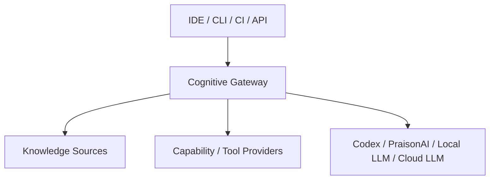

# 3. Context and Scope

## 3.1 Business context

Cognitive Gateway mediates between task-producing clients and task-executing AI/agent runtimes.

## 3.2 Inputs

Typical inputs include:

- natural-language user tasks;
- issue or work-item metadata;
- request-scoped governance and configuration state;
- repository state;
- workflow/gate/blocker state;
- runtime and test evidence.

## 3.3 Outputs

Primary outputs are:

- validated workflow/agent/skill selections;
- policy decisions;
- retrieval plans;
- approved capability sets;
- versioned `ExecutionContextIR`;
- compiled stable and dynamic context;
- explainability/audit traces.

## 3.4 External systems

Potential external systems include:

- Git repositories;
- GitHub;
- IDE integrations;
- MCP servers;
- local model runtimes;
- PraisonAI;
- Codex/OpenAI runtimes;
- vector or graph stores in later releases.

## 3.5 External project context

Product-specific knowledge does not belong in the built-in Agent or Skill
catalog. A consuming project supplies repository content, configuration, state
and evidence through explicit runtime, input, retrieval or adapter boundaries.
Reusable Agents and Skills, including technology-specific specialists, are
resolved from the shared catalog; external context cannot alter catalog
membership.
