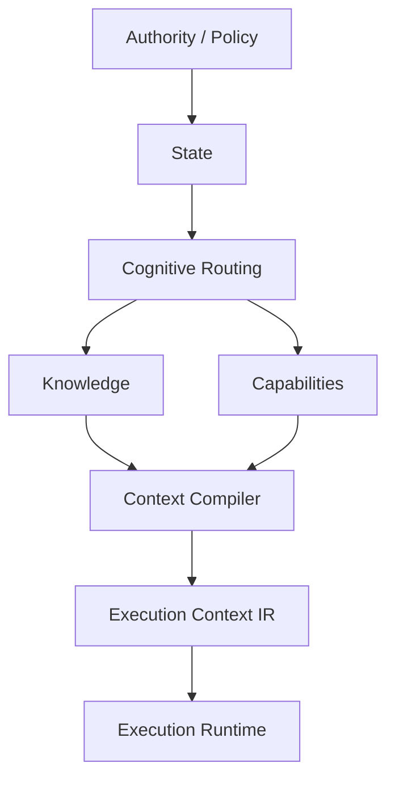
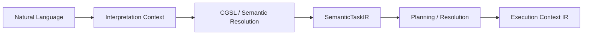

# 4. Solution Strategy

Cognitive Gateway uses a layered control-plane architecture.

## Key strategies

### Deterministic first

The initial system resolves workflows, agents, skills, dependencies and
policies without an LLM. Probabilistic services are optional enhancements and
cannot create authority or bypass validation.

### Hexagonal structure and ports

Ports & Adapters is the structural architecture strategy. Driving adapters such as CLI, API, IDE and CI enter through inbound application ports. The application and domain core owns validation, deterministic routing, policy evaluation and context compilation. It reaches external concerns only through outbound ports implemented by driven adapters.

The control-plane concepts map onto the hexagon as follows:

- **Authority** and **State** are validated domain inputs and constraints.
- **Cognitive Routing** is an application/core responsibility that determines the relevant workflow, primary agent, skills and knowledge queries.
- The **Knowledge Plane** is accessed through knowledge/retrieval ports; Git, filesystem, vector and graph RAG implementations are driven adapters.
- The **Capability Plane** is accessed through capability ports; MCP, repository, Git and quality-tool integrations are driven adapters subject to policy.
- The **Context Compiler** is an application/core service that produces the validated Execution Context IR.
- The **Execution Runtime** is reached through an execution-runtime port; Codex, PraisonAI, local models and cloud models are replaceable driven adapters.

The dependency rule is inward-only: adapters depend on application ports and domain abstractions, while the core never imports adapter technologies.

### Semantic interpretation and Execution Context IR

The implemented deterministic pipeline consumes validated structured contracts
and produces provider-independent execution context. Natural-language input is
**not yet** a fully implemented direct compiler path.

EPIC-05 defines the target semantic frontend:

Mandatory unresolved or ambiguous semantics must remain explicit and must not
be guessed. Optional SLM/LLM interpretation can propose candidates, but the
canonical result is validated deterministically.

The current `ExecutionContextIR` field contract, invariants and JSON
compatibility rules are defined in [`../execution-context-ir.md`](../execution-context-ir.md)
and [`../ir-serialization.md`](../ir-serialization.md). The planned semantic
frontend is documented in
[`../semantic-language-and-interpretation.md`](../semantic-language-and-interpretation.md).

### Local cognitive services

A local SLM/LxM may provide semantic classification, extraction, ranking or
other bounded cognitive signals. It is an optional adapter/service and never an
authority source.

CG-27 and CG-27.01 define a provider-neutral local inference port, a separately
deployable containerized model runtime, model manifests/profiles, benchmark
qualification, explicit promotion and rollback. Qwen3-8B quantized is a
reference candidate, not a core dependency. See
[`../local-model-runtime.md`](../local-model-runtime.md).

### Progressive retrieval

v0.1 starts with filesystem, Git and registry retrieval. Vector and graph retrieval are introduced only after the deterministic core is proven.

### Minimal context

The context compiler emits only required authority, workflow, skill and
retrieved-knowledge inputs. The IR remains structured and provider-independent;
rendering it into runtime-specific prompts or requests belongs outside the
domain contract.

### MCP connector and client boundaries

MCP is infrastructure, not domain semantics. EPIC-04 defines the planned inbound
Codex -> CG local MCP boundary, while EPIC-07 defines the planned outbound
CG -> external MCP server/plugin runtime. Both reuse existing application,
policy, provenance and capability contracts rather than creating new authority
planes. See [Codex local integration](../codex-local-integration.md) and
[MCP connector runtime](../mcp-connector-runtime.md).

### Governed procedural learning

CG-21 now provides the implemented model-independent domain foundation for
eligible experience, pattern candidates, immutable learned procedure versions
and explicit procedure lifecycle transitions. These contracts do not grant
authority and remain subordinate to existing process/capability/policy
identities. The EPIC-03 experience/pattern, evaluation, promotion and reflex
reference runtime is implemented and covered by [complete acceptance](../epic-03-complete-acceptance.md). See [learned procedures](../learned-procedures.md).
