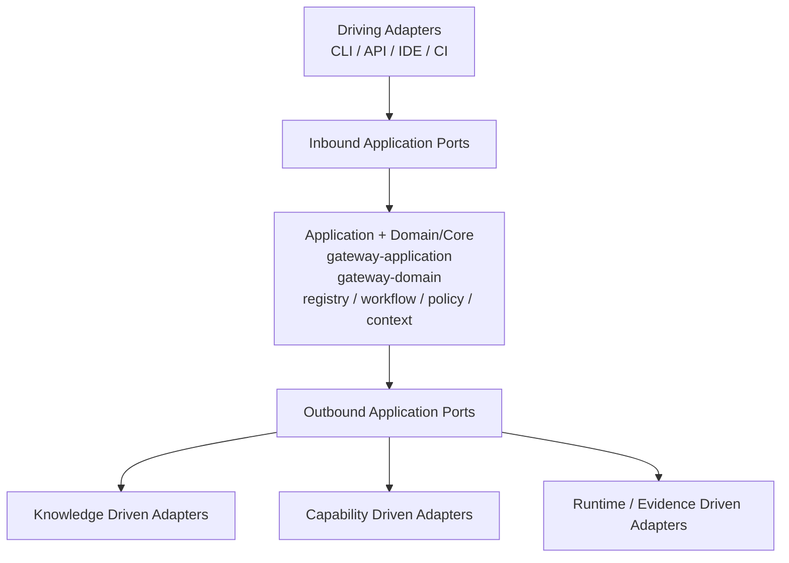

# 5. Building Block View

## 5.1 Level 1

### Gateway Core

The deterministic core follows Hexagonal Architecture. It owns stable domain concepts, application ports, deterministic registries, workflow resolution, policy evaluation and context compilation.

### Cognitive Services

Optional services provide semantic classification, embeddings, RAG, graph retrieval, ranking and summarization. They are outside the deterministic core and connect through knowledge/retrieval ports.

### Execution Runtime Adapters

Codex, PraisonAI, local LLMs and cloud LLM APIs are replaceable driven adapters behind execution-runtime ports.

### Capability Adapters

Repository, Git, quality gates, runtime inspection, GitHub and MCP/tool integrations are controlled adapters behind capability ports. Retrieval never grants capability permissions.

## 5.2 Rust workspace and hexagonal mapping



Initial crates:

```text
crates/
├── gateway-domain/
├── gateway-application/
├── gateway-process/
├── gateway-registry/
├── gateway-workflow/
├── gateway-policy/
├── gateway-context/
└── gateway-daemon/
```

The intended responsibility of each current crate is:

- `gateway-domain`: typed identifiers, immutable definitions, execution state,
  capabilities, constraints, `ExecutionContextIR` and domain validation;
- `gateway-application`: inbound use-case ports, outbound ports and application orchestration;
- `gateway-process`: deterministic process compilation, lifecycle and activity readiness;
- `gateway-registry`: deterministic loading and validation of registered definitions;
- `gateway-workflow`: compile-only placeholder; the former CG-05 registry scope
  was merged into the single `gateway-process` authority under CG-04;
- `gateway-policy`: authorization and fail-closed policy evaluation;
- `gateway-context`: validated context compilation and Execution Context IR handling;
- `gateway-daemon`: composition root and future process/transport wiring, outside the core.

Concrete CLI/API/IDE/CI driving adapters and Git/RAG, MCP/tool, runtime and
evidence driven adapters are outer components. They must implement the
contracts exposed by `gateway-application` rather than introduce dependencies
into `gateway-domain` or the deterministic core.

### Legal dependency direction

- `gateway-domain` contains stable domain concepts and has no provider,
  transport or infrastructure dependency; `serde` and `serde_json` are the
  explicitly allowed serialization dependencies for the versioned wire
  contract.
- `gateway-application` contains application use cases and defines inbound and outbound ports; it composes `gateway-domain`, `gateway-registry`, `gateway-process`, `gateway-policy` and `gateway-context`. These deterministic components depend on domain contracts and never depend back on application.
- `gateway-registry`, `gateway-workflow`, `gateway-policy` and `gateway-context` are deterministic inner components and depend only on inner abstractions required by their responsibility.
- `gateway-daemon` is the initial outer composition root and may depend on inner crates and, later, on concrete adapters.
- driving adapters may call inbound ports; driven adapters may implement outbound ports. Both depend on core-defined contracts.
- the core must never depend on adapters, transport frameworks, providers, databases, Git/GitHub details or concrete MCP implementations.
- circular crate dependencies are forbidden.

### Adapter attachment points

```text
KnowledgePort       <- existing Git / filesystem knowledge adapters
RetrievalPlanner    <- explicit bounded retrieval planning
KnowledgeRetrievalPort <- lexical / semantic / graph / memory adapters
EmbeddingPort       <- replaceable embedding services
TokenEstimatorPort  <- replaceable tokenizer / estimation services
ReasoningAdapter    <- provider strategy support and bounded attempt adapters
CapabilityPort      <- MCP / Git / quality / GitHub / runtime-tool adapters
ExecutionRuntimePort<- Codex / PraisonAI / local/cloud LLM adapters
EvidencePort        <- audit/evidence persistence adapters
```

These are attachment points, not permissions. The policy engine decides whether a capability request is allowed; an adapter only performs the operation authorized through its port. Knowledge adapters return knowledge and provenance, never authority or permissions.

The application boundary represents consuming-project configuration as an
opaque request-scoped `ProjectContext`. A `KnowledgeRequest` may carry that
scope explicitly, while a knowledge adapter returns typed `RetrievedKnowledge`
with `KnowledgeProvenance`. Neither value is a catalog definition or an
authority-bearing execution field.

The adapter technologies are replaceable implementation choices. Their
provider-specific configuration and behavior do not belong in the domain
contract.

CG-15 adds versioned retrieval IR in `gateway-domain::retrieval_plane` with
immutable executable plans, explicit finite budgets and stop conditions,
scoped provenance, derived embedding lineage, and exact/estimated/unknown token
counts. The application owns all four new outbound traits. No new dependency
edge is needed. See [the retrieval contract](../retrieval-plane.md) and
[ADR-011](../adr/ADR-011-modular-retrieval-plane.md).

CG-16 adds deterministic federation, fusion and reranking contracts in
`gateway-application` and filesystem/Git plus in-memory vector adapters in
the outer `gateway-daemon` crate. The vector adapter uses the embedding port
and checks source snapshots before search. See
[the retrieval pipeline](../retrieval-pipeline.md).

CG-17 adds versioned graph nodes, edges and derived projection manifests in
`gateway-domain`. `gateway-application` owns bounded, deterministic traversal
and the replaceable `GraphProjectionPort`. An in-memory graph store and a CG-16
graph source adapter live in `gateway-daemon`. Source snapshots determine
projection eligibility; graph paths retain original scope and provenance and
cannot grant authority. See [knowledge graph and graph retrieval](../knowledge-graph.md).

CG-19 adds deterministic sufficiency assessment to the domain and bounded
round orchestration to the application. Refiners propose only query sets;
the evidence port validates links. Retrieval findings may pause CG-14 but
cannot authorize execution or alter process state. See
[recursive retrieval](../recursive-retrieval.md).

CG-20 adds provider-independent evaluation and release-threshold contracts in
`gateway-domain`, reference-only curated export and diagnostic profiling in
`gateway-application`, and versioned datasets and gate automation outside the
core. CG-20D consumes these contracts in an external-project fake-port replay.
Neither evaluation scores nor exported memory grant process or policy authority.
See [EPIC-02 evaluation](../epic-02-evaluation.md) and [ADR-014](../adr/ADR-014-versioned-evaluation-and-learning-export.md).

## 5.3 Proposed Python services

```text
cognitive-services/
├── classifier/
├── embeddings/
├── retrieval/
└── graph/
```

Python cognitive services remain optional and sit outside the deterministic Rust core.

## 5.4 Agent and Skill catalog

```text
catalog/
├── agents/
└── skills/
```

The catalog is the sole built-in Agent and Skill definition boundary. It
contains reusable, schema-validated definitions and has no project namespace
or override layer. Consuming-project repository content, configuration and
runtime state are supplied through explicit ports and adapters. Agent and
Skill documents may carry typed `provided_capabilities` contracts containing
canonical identity, domain, inspect/mutate class, input/output kinds,
intrinsic preconditions and deterministic applicability tags. These contracts
describe reusable provider capability only; policy still decides whether an
execution may use it.

### Enforced dependency graph (CG-13)

`scripts/check-dependencies.py` checks Cargo metadata for every workspace
member and every normal, development, build, optional and target dependency.
The reviewed direct dependency allowlist is:

| Crate | Allowed workspace dependencies | Allowed external dependencies |
| --- | --- | --- |
| domain | none | serde, serde_json |
| application | domain, registry, process, policy, context | serde, serde_json, sha2 |
| registry | domain | none |
| workflow | domain | none |
| process | domain | serde, serde_json, sha2 |
| policy | domain | serde, serde_json (test support) |
| context | domain | serde, serde_json |
| daemon | all seven inner crates | serde, serde_json, sha2 |

Crate names in the table have the `gateway-` prefix. New workspace members,
dependency edges or external libraries require a reviewed update to this table
and the executable allowlist. Renaming a dependency does not change its package
identity. Core dependencies must resolve to the workspace source. Cargo checks
its full resolved graph for cycles; the guard also checks workspace edges.
Transitive serialization/cryptography implementation dependencies remain
controlled by `Cargo.lock`; this check is not a dependency vulnerability audit.

## CG-18 governed memory boundary

`gateway-domain::memory` defines versioned experience, curation and eligibility references.
`gateway-application::memory` owns admission, lifecycle decisions, scoped recall and
revalidation of pinned learning references through `MemoryStore`. The outer
`gateway-daemon::memory` adapter proves atomic revision checks and payload erasure
in memory; production persistence must provide durable atomic commits and retain
revocation history. CG-10 receives only eligible memory as a derived-assessment
fragment with validation and revision. Memory text has no authority over policy,
capabilities or process state. See [governed memory](../governed-memory.md).

CG-20B keeps deterministic context selection in `gateway-context`, composes
current authorization and estimation in `gateway-application`, and exposes
optional tokenizer and compaction ports to outer adapters. See
[context budgeting](../context-budgeting.md).

## 5.5 Semantic interpretation plane (planned EPIC-05)

CGSL/`SemanticTaskIR` is a planned semantic frontend, not a replacement for
CG-06/07/08. A parser/compiler adapter must remain independent from model and
network providers. Optional model interpretation produces proposals only; a
deterministic compiler/validator owns canonical semantics. See
[semantic language and interpretation](../semantic-language-and-interpretation.md).

## 5.6 MCP connector/plugin runtime (planned EPIC-07)

The MCP client/runtime is an outer infrastructure block. It owns transport,
server lifecycle, discovery and invocation. Canonical source/capability
mapping, scope, provenance, trust, sensitivity, authorization and retry
decisions remain Gateway responsibilities. GitHub is a reference connector,
not a core dependency. See [MCP connector runtime](../mcp-connector-runtime.md).

## 5.7 Codex local adapter (planned EPIC-04)

The Codex-facing local MCP adapter is a driving adapter into a shared
application facade. It must not reproduce connector runtime logic and must not
bring Codex/OpenAI types into authoritative contracts. See
[Codex local integration](../codex-local-integration.md).

## 5.8 Local inference runtime (planned CG-27)

Local inference is a separately replaceable driven service behind a stable
port. Model/runtime profile, artifact digest, quantization, capability and
qualification metadata are explicit. The deterministic core must continue to
operate when the runtime is unavailable. See
[local model runtime](../local-model-runtime.md).

## 5.9 Learned procedure domain (CG-21 foundation implemented)

`gateway-domain::learning` defines situation fingerprints, eligible
experience bases, pattern candidates, immutable/digest-bound learned
procedures, procedure steps referencing existing process/capability/policy
identities, verification requirements and append-only lifecycle transitions.
These types support EPIC-03 without allowing historical experience to become
authorization. See [learned procedures](../learned-procedures.md).
