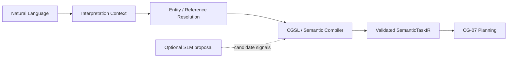
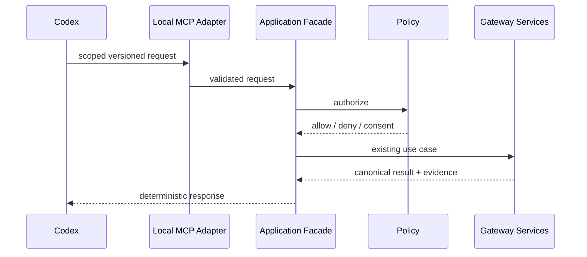
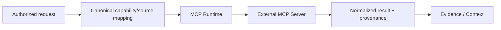

# 6. Runtime View

## 6.1 Representative port-and-adapter request flow

The representative request flow makes the runtime boundary explicit:

```text
Driving Adapter (CLI / API / IDE / CI)
                |
                v
Inbound Application Port (submit task)
                |
                v
Application + Domain/Core
  validate -> resolve -> authorize -> build IR
                |
                v
Outbound Port (knowledge / runtime / evidence)
                |
                v
Driven Adapter (Git/RAG, runtime or evidence implementation)
                |
                v
Result + provenance/audit evidence
```

The driving adapter translates the transport request into the inbound port contract. The core performs deterministic validation, resolution and policy evaluation. The selected outbound port is implemented by a replaceable driven adapter, and the result returns through the application boundary with provenance or audit evidence where applicable.

Knowledge retrieval is not executable capability use: a knowledge adapter returns retrieved material and provenance. A capability request follows a separate policy-controlled capability port and may be denied before any MCP/tool adapter is called.

## 6.2 Deterministic request flow

```text
Task
  |
  v
Catalog Loader
  |
  v
Registry Validation
  |
  v
Workflow / Agent / Skill Resolver
  |
  v
Policy Engine
  |
  v
Context Compiler / Execution Context IR
  |
  v
CLI / Runtime Adapter
```

This path must work without an LLM or external network access in v0.1.
The Catalog Loader receives only the Gateway-owned catalog boundary. Consuming
project context enters through explicit request, input, retrieval or adapter
ports; it may influence a request-scoped plan, but it cannot add, replace or
override an Agent or Skill definition. In the application contract this input
is an opaque `ProjectContext` carried by `ExecutionRequest`; it is not part of
the registry or `ExecutionContextIR`.

## 6.3 Semantic interpretation flow (planned EPIC-05)

The target natural-language frontend is:



The SLM is optional. It proposes interpretation candidates; it does not define
canonical semantics. Mandatory ambiguity or knowledge gaps remain explicit and
may require retrieval or clarification. Until EPIC-05 is implemented, callers
must use existing structured inputs for deterministic execution.

## 6.4 Retrieval flow

```text
Validated task + selected skills
        |
        v
Retrieval Planner
        |
        +--> repository search
        +--> vector retrieval
        +--> graph retrieval
        +--> evidence history
        |
        v
Retrieved knowledge with typed provenance
        |
        v
Context Compiler
```

Retrieval never grants capabilities or overrides policy.

## 6.5 Tool execution flow

```text
Execution Runtime
       |
       v
Capability request
       |
       v
Policy Engine
       |
   allow / deny
       |
       v
MCP / Tool Adapter
```

Mutation requests may require explicit authorization while inspection requests can remain available. The MCP/tool adapter is a driven capability adapter and cannot change the policy decision made by the core.

## 6.6 Closed-loop goal execution

CG-14 adds an event-driven application coordinator: Intent and scoped evidence
produce a Situation, Delta and Plan; fresh resolution, policy and process
inputs authorize one compiled step; a replaceable execution port returns a
correlated Outcome and complete observation snapshot. CG-06 reassessment and
CG-07 comparison determine success, continuation, replanning, pause or stop.
Iteration and retry limits bound execution across replans. Every revision and
execution remains linked in the audit. Process lifecycle mutation remains with
CG-04. See [the application contract](../closed-loop-execution.md).

## 6.7 Codex local invocation (planned EPIC-04)



CG stores no OpenAI API key for this path and Codex remains a client rather
than an authority source.

## 6.8 External connector invocation (planned EPIC-07)



Discovery is not authorization. Mutation retry safety, credentials, trust,
sensitivity and scope are explicit Gateway-managed concerns.

## 6.9 Local model invocation and upgrade (planned CG-27)

A logical model role resolves to a qualified model profile. The local inference
port calls a separately deployable runtime. Candidate model upgrades are
benchmarked and qualified before explicit promotion; rollback restores the
previous qualified profile without rebuilding the Gateway.

## 6.10 Learned procedure lifecycle (CG-21 foundation implemented)

Eligible governed experience may be represented as a `PatternCandidate` and
compiled into a digest-bound `LearnedProcedure`. Lifecycle changes are explicit
events (draft/evaluated/approved/active/suspended/retired/rejected). Reuse still
passes through existing process, capability and policy authority; the broader
automatic discovery/evaluation/reflex path remains EPIC-03 work.
