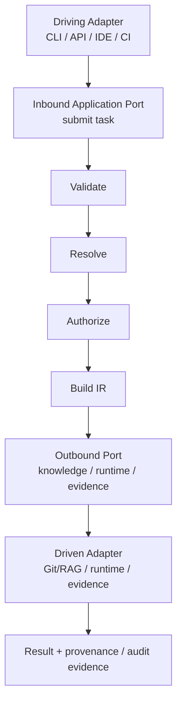
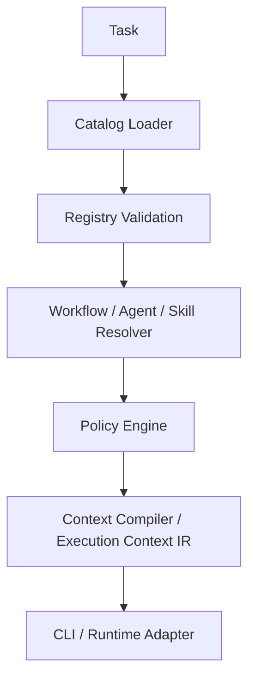
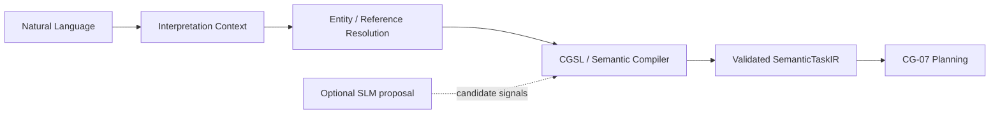
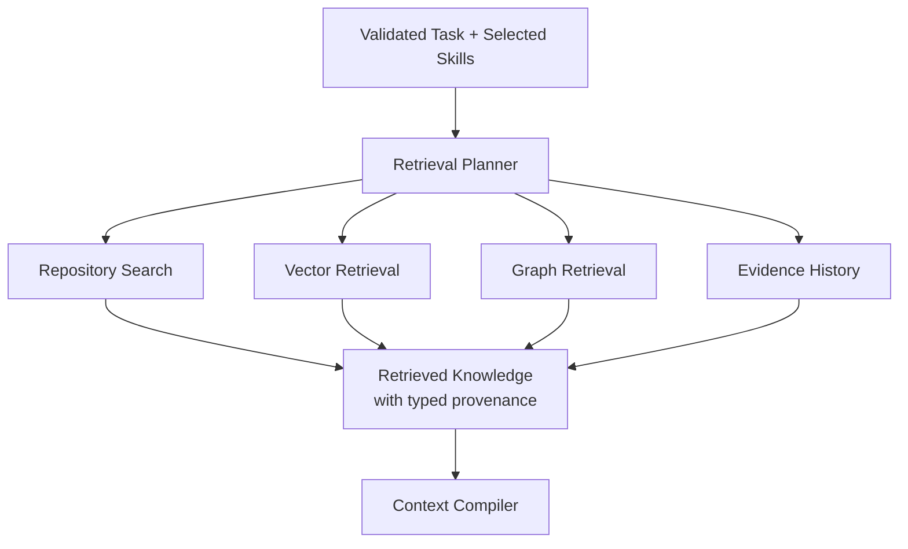
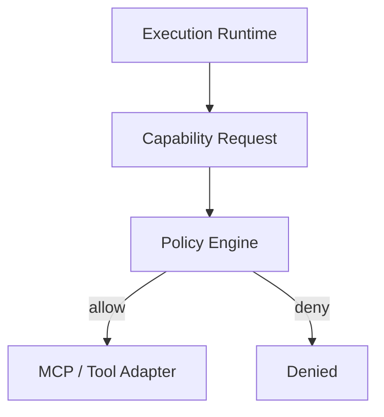
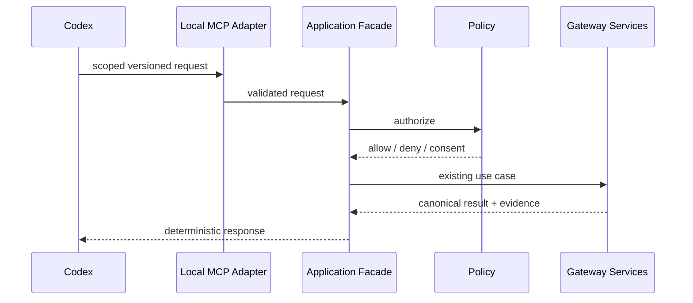
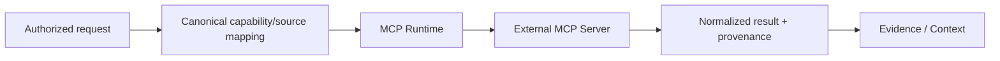

# 6. Runtime View

## 6.1 Representative port-and-adapter request flow

The representative request flow makes the runtime boundary explicit:

The driving adapter translates the transport request into the inbound port contract. The core performs deterministic validation, resolution and policy evaluation. The selected outbound port is implemented by a replaceable driven adapter, and the result returns through the application boundary with provenance or audit evidence where applicable.

Knowledge retrieval is not executable capability use: a knowledge adapter returns retrieved material and provenance. A capability request follows a separate policy-controlled capability port and may be denied before any MCP/tool adapter is called.

## 6.2 Deterministic request flow

This path must work without an LLM or external network access in v0.1.
The Catalog Loader receives only the Gateway-owned catalog boundary. Consuming
project context enters through explicit request, input, retrieval or adapter
ports; it may influence a request-scoped plan, but it cannot add, replace or
override an Agent or Skill definition. In the application contract this input
is an opaque `ProjectContext` carried by `ExecutionRequest`; it is not part of
the registry or `ExecutionContextIR`.

## 6.3 Semantic interpretation flow (planned EPIC-05)

The target natural-language frontend is:

The SLM is optional. It proposes interpretation candidates; it does not define
canonical semantics. Mandatory ambiguity or knowledge gaps remain explicit and
may require retrieval or clarification. Until EPIC-05 is implemented, callers
must use existing structured inputs for deterministic execution.

## 6.4 Retrieval flow

Retrieval never grants capabilities or overrides policy.

## 6.5 Tool execution flow

Mutation requests may require explicit authorization while inspection requests can remain available. The MCP/tool adapter is a driven capability adapter and cannot change the policy decision made by the core.

## 6.6 Closed-loop goal execution

CG-14 adds an event-driven application coordinator: Intent and scoped evidence
produce a Situation, Delta and Plan; fresh resolution, policy and process
inputs authorize one compiled step; a replaceable execution port returns a
correlated Outcome and complete observation snapshot. CG-06 reassessment and
CG-07 comparison determine success, continuation, replanning, pause or stop.
Iteration and retry limits bound execution across replans. Every revision and
execution remains linked in the audit. Process lifecycle mutation remains with
CG-04. See [the application contract](../closed-loop-execution.md).

## 6.7 Codex local invocation (planned EPIC-04)

CG stores no OpenAI API key for this path and Codex remains a client rather
than an authority source.

## 6.8 External connector invocation (planned EPIC-07)

Discovery is not authorization. Mutation retry safety, credentials, trust,
sensitivity and scope are explicit Gateway-managed concerns.

## 6.9 Local model invocation and upgrade (CG-27.01 reference service)

A logical model role resolves to a qualified model profile. The local inference
port calls a separately deployable runtime. Candidate model upgrades are
benchmarked and qualified before explicit promotion; rollback restores the
previous qualified profile without rebuilding the Gateway.

## 6.10 Learned procedure lifecycle (CG-21, CG-23, CG-24 implemented)

Eligible governed experience becomes a `PatternCandidate` and a digest-bound
`LearnedProcedure`. [CG-23](../procedure-evaluation.md) evaluates historical
snapshots and counterfactuals, retaining reproducible passing evidence.
[CG-24](../procedure-promotion.md) implements discovered/candidate/validated/
evaluated/approved/canary/active admission through authenticated application
commands and an append-only version registry. Canary execution is bounded by
scope, cohort, time and outcome budgets. Supersession and rollback atomically
change active versions while preserving evidence and historical outcomes.
The read-only `cg procedures` command inspects the complete journal without a model.
Reuse still requires current process, capability and policy authorization;
[CG-25](../reflex-engine.md) adds exact ACTIVE matching, evidence gates, compiled
Process/Policy dispatch, budgets and post-execution verification. The complete EPIC-03 reference lifecycle and durable CPU inference integration
are covered by [complete acceptance](../epic-03-complete-acceptance.md).

The CG-27.01 reference deployment, provider-neutral port and qualification lifecycle
are implemented; see [the operator guide](../local-model-runtime.md). Full
SemanticTaskIR interpretation remains EPIC-05.11 work.

## Inbound canonical and session delivery

The admitted local `cg-mcp`/`cg-local` composition root optionally maps pinned
plan/rules/process records through the shared strict CLI input mapper into
canonical resolution, explanation and context compilation. Existing application
services own computation and Process/Policy checks; trusted admission owns the
source classification and operation grant. Generated resolution references are
checked against the current canonical artifact before explain, compile or read.
See [canonical host](../codex-canonical-host.md).

The actual installed Codex client has exercised these paths with neutral admitted
fixture snapshots and full CLI envelope parity, separately from synthetic
protocol/component tests. See [installed-client qualification](../codex-installed-client-qualification.md).
Session service delivery remains pending. [Accepted contract ADR-021](../adr/ADR-021-shared-structured-session-ownership.md)
specifies one application-owned coordinator, a verified context artifact as the
explicit goal, exact trusted interactions and a separate v2 session boundary.
See the [typed specification and prerequisite matrix](../shared-session-contract.md).
The artifact verifier and #272/#273/#275/#276/#277 services remain delivery work;
no session lifecycle is claimed by the standalone host or this runtime diagram.
