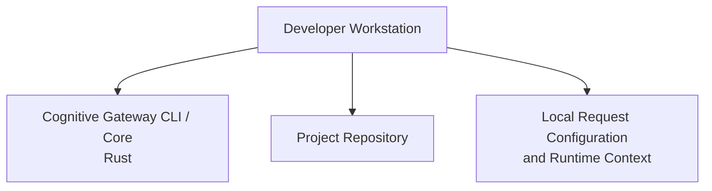
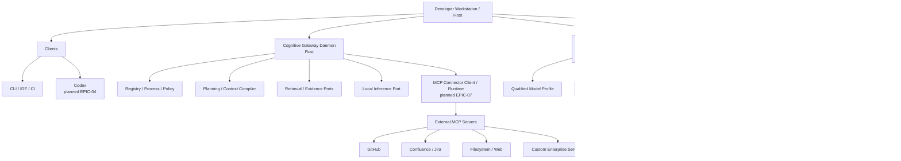

# 7. Deployment View

## 7.1 v0.1

v0.1 is a local developer-side deployment.

No external AI service is required for deterministic validation and resolution.

## 7.2 Planned daemon deployment

## 7.3 Model deployment

Local cognitive models run behind a stable provider-neutral port and may be
hosted in a separate container/process. CG-27.01 requires an independently
upgradable model service with persistent artifacts, health/readiness,
CPU-only baseline operation, optional GPU acceleration, explicit model profile
and qualification/rollback lifecycle.

Qwen3-8B quantized is a reference profile only. Replacing it with a compatible
future model must not require changes to authoritative Gateway domain contracts.
See [local model runtime](../local-model-runtime.md).

## 7.4 Portability

The target is a local cross-platform developer tool. Packaging should favor a self-contained Rust binary for the control plane, with optional separately installable cognitive services.

## 7.5 MCP deployment boundary

EPIC-07 MCP servers are external dependencies. Their credentials, process
lifecycle and transport configuration remain outside the deterministic core.
A connector may run locally, in another container or remotely as allowed by the
selected MCP transport and security profile. Connector admission is explicit
and scope-isolated.
