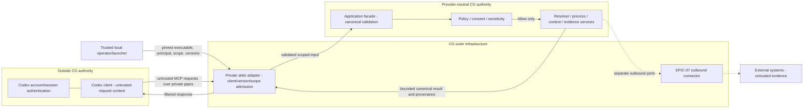

# Codex Local Integration

## Status and decision

**Boundary defined — EPIC-04.01 #236; local adapter implemented — #238.**
The accepted decision is [ADR-020](adr/ADR-020-codex-local-trust-no-key-contract.md).
The [versioned wire contract](codex-facing-contracts.md) is defined by EPIC-04.02 #237.
This is the normative trust and ownership contract. The
[local MCP server](local-mcp-server.md) implements private stdio lifecycle and
discovery. The [application facade](codex-application-facade.md) (#239) and [workspace/session admission](codex-scope-isolation.md) (#240) are implemented. Live client qualification remains #245.

## Direction and ownership

EPIC-04 is **Codex -> Cognitive Gateway**, a local driving adapter into existing
application use cases. EPIC-07 is **Cognitive Gateway -> external MCP servers**,
driven connectors behind core-owned ports. Neither implements the other's
runtime. A CG-to-Codex execution-runtime adapter is outside this inbound path.

| Responsibility | Owner | Boundary |
| --- | --- | --- |
| Account/session authentication and provider credentials | Codex | Outside CG; never accepted as CG authorization |
| Executable/configuration integrity and private process launch | Local operator/launcher | Trusted deployment inputs, not request fields |
| MCP framing, client/version admission, transport limits | EPIC-04 inbound adapter | Outer infrastructure only |
| Local principal and workspace/project/session binding | CG local admission | Trusted launch configuration and CG scope records |
| Shared facade and canonical validation | `gateway-application` | Provider-neutral; MCP and diagnostic CLI use the same services |
| Authorization, consent and capability classification | Existing CG policy/application services | Current trusted CG facts only |
| Process, resolution, context, verification and provenance | Existing CG services | No duplicate adapter semantics |
| External MCP authentication/connection/lifecycle | EPIC-07 outbound adapters | Separate credentials and policy; no inbound credential forwarding |

Shared MCP utilities may exist only in outer infrastructure. They must not couple
inbound admission to outbound connector configuration or own CG policy semantics.

## Trust-boundary diagram

## Local-process trust and IPC assumptions

The first transport is private parent/child **stdio**, with protocol frames on
stdout and sanitized diagnostics on stderr. Network listeners, loopback HTTP,
Unix sockets and named pipes require a separate reviewed peer authentication and
access-control contract. Locality alone proves neither identity nor permission.

The operator trusts the launcher, adapter executable, OS isolation and CG-owned
configuration/storage. Trusted configuration pins the admitted client identity,
supported client compatibility and protocol/schema versions, local principal and
workspace/project/session scope. Pipe handles must not be shared with unrelated
processes. A client-supplied name, version, account ID or workspace is a claim to
check against that binding, not an authentication mechanism. Stdio cannot prove
the vendor of the parent executable: admission relies on trusted launch and the
private channel, not on an MCP client name. Missing or unverifiable launch binding
must deny admission.

Every request must match the admitted session and CG-owned workspace/project
mapping. Canonical filesystem scope resolution must reject ambiguous roots,
traversal, symlink escapes and cross-project references. Revalidate scope before
use; reconnect creates a fresh binding. Never infer scope from ambient current
directory, model text or the last project used.

This model does not promise isolation from a compromised OS, malicious trusted
launcher or an attacker able to alter CG authority files/executables or inspect
same-user process memory. These are deployment assumptions, not reasons to trust
request content as authority.

## No-key contract

For this connection path, CG **never receives, stores, requires or relays an
OpenAI API key**, Codex account token or Codex session credential. Codex owns its
own authentication. This does not imply that Codex is unauthenticated or that
unrelated model/connector paths have no credentials.

Implementation obligations:

- Bootstrap and request schemas have no provider-key/account-token requirement or
  field. No provider SDK login, API call or authentication fallback occurs when
  local admission fails.
- Launch CG with an explicit environment allowlist excluding provider credentials.
  CG does not read Codex auth stores, home-directory auth files or inherited
  provider credential variables. Local identity/scope is independent of Codex login.
- Reject credential-bearing configuration and declared credential fields before
  application handoff. Never log raw rejected frames or environment dumps. Secrets
  must not enter canonical state, responses, audit records, traces, cache keys or
  persisted request bodies.
- CG sensitivity/reference-only rules govern context and output. Source identity,
  revision, digest, freshness and evidence lineage survive filtering. Clients
  cannot downgrade sensitivity or request raw secret disclosure.

Arbitrary text may contain an unsolicited secret; no interface can prevent a
hostile client writing secret bytes to a pipe. Such input is outside the accepted
contract and must not be forwarded or retained as an authorized credential.
Bounded handling and secret-isolation qualification belong to #241/#245. This
slice defines obligations, not a completed runtime credential guarantee.

## Operation classes and default authority

| Class | Examples | Authority |
| --- | --- | --- |
| Protocol control | Initialize, discover, cancel | Bounded adapter handling; no execution permission or protected resource disclosure |
| Inspect | Inspect/resolve/explain, compile scoped context | Default exposed posture; current CG authorization and sensitivity filtering still required |
| Mutate | Execute state-changing capability, submit persistent evidence | Disabled by default; explicit existing CG policy authorization, exact scope, trusted consent, evidence and process gates required |
| Administrative | Policy/capability grants, definition promotion, configuration changes | Not initially exposed; future governed use cases need a reviewed contract and CG authorization |

Inspect/Mutate are existing canonical capability classes. Administrative is a
surface restriction, not a new domain enum. Plans/context are proposals, not
execution permission. Inspect has no domain mutation side effects; bounded
operational audit is permitted. Classify using the complete canonical capability
closure, never a client-supplied `read-only` flag. Only `Allow` executes;
`Deny`, `RequireConsent` and `RequireEvidence` remain non-executing results.
Consent comes from trusted CG records, not client assertions or Codex approvals.

Codex cannot directly grant capabilities, alter policy or advance process state.
An authorized mutation invokes an existing use case; CG still owns transitions
and verification. OperatingMode/ExecutionProfile, including FULL_PATH, never
elevate authority. See [policy-engine.md](policy-engine.md).

## Fail-closed admission

Before dispatch or protected output: decode bounded frames, verify the trusted
local binding, check explicitly supported client and protocol/schema versions,
bind scope, validate operation/canonical inputs, then evaluate current CG policy.
Reevaluate authority immediately before side effects. Never reuse an Allow across
changed scope, policy, consent, evidence or process revisions.

| Invalid condition | Required result |
| --- | --- |
| Missing/unknown/unsupported/mismatched client identity | Reject session; no facade dispatch |
| Missing/unsupported protocol or schema version | Reject; no guessed downgrade or permissive fallback |
| Missing/ambiguous workspace, wrong project/session, revoked binding | Reject; no ambient scope fallback or cross-scope output |
| Unknown operation, malformed input, changed capability class | Reject; no dynamic execution of supplied names |
| Unauthorized Inspect, Mutate or administration | No side effect/protected result; preserve CG denial/consent/evidence outcome |
| Missing trusted authority, sensitivity metadata or required provenance | Fail closed; no fabricated facts or unclassified disclosure |
| Overload, oversized input, timeout, cancellation, disconnect | Bounded termination; no authority elevation or automatic mutation retry |

Diagnostics must be stable and non-sensitive: no rejected payload echo or
cross-workspace existence disclosure. #237 defines wire schemas/codes and exact
supported versions; #243 defines limits/cancellation/uncertain mutation outcomes.
Determinism applies to canonical CG inputs/results, not transport IDs or timing.
No partial handshake grants application access.

## Threat model

Assets: policy/consent authority, process state, scoped knowledge, provenance,
sensitive data, provider credentials and deterministic execution results.

| Threat | Control / failure behavior | Qualification owner |
| --- | --- | --- |
| Spoofed client name/unrelated local process | Trusted launch/private pipes; claimed name alone cannot admit | #238, #240, #245 |
| Downgrade, malformed/oversized frames | Explicit versions and strict bounded decode; reject before dispatch | #237, #238, #243, #245 |
| Confused deputy via workspace/session reuse | Canonical roots/project binding; reject traversal, symlink escape and stale scope | #240, #245 |
| Prompt injection posing as policy | Model/retrieved input stays non-authoritative; CG-owned policy/consent only | #239, #242, #245 |
| Mutation disguised as Inspect/discovery | Complete capability closure and policy gates; discovery grants nothing | #242, #245 |
| Credential leaks via environment/config/output/logs | No-key launch/input contract, sensitivity filters, no raw persistence | #241, #245 |
| Replay/stale Allow or consent | Current authority revalidation; reports are not execution tokens | #240, #242, #245 |
| External connector authority laundering | Separate EPIC-07 ports; evidence grants no client permission | #239, #242, #245 |
| Duplicate mutations or exhaustion after disconnect/retry | Bounded runtime, explicit outcome/retry semantics, no guessed replay | #243, #245 |
| Provider/protocol coupling in core | Dependency allowlist and module/type review | #236, #245 |

## Crate and module dependency rules

- `gateway-domain` owns canonical semantics; `gateway-application` owns the shared
  provider-neutral facade/ports. Neither imports/exports Codex/OpenAI SDK types,
  MCP framing, provider credentials or provider-specific protocol DTOs.
- `gateway-policy`, `gateway-process`, `gateway-registry`, `gateway-context` and
  `gateway-workflow` keep existing inner dependencies. No imports from the local
  adapter, daemon, provider SDK or MCP implementation are allowed.
- The inbound adapter lives in outer infrastructure (initially
  `gateway-daemon` modules, or a separately reviewed adapter crate). It translates
  DTOs and depends inward on application contracts. The core never depends back.
  Naming a facade after a client does not permit provider-specific contracts.
- Outbound connector modules remain separate from inbound modules. Shared helpers
  own framing only, not authentication, CG policy or process semantics.
- New dependencies, workspace crates and edges require architecture graph review.
  This decision adds none.

`scripts/check-dependencies.py` checks normalized Cargo dependencies, including
normal/dev/build/target edges, renamed packages and source substitution, against
the reviewed allowlist. `scripts/check-architecture.sh` runs it in the release gate.
Provider/MCP mutation regressions are in `tests/architecture/test_dependencies.py`.
These enforce crate edges; they cannot prove locally defined DTO neutrality or
secret isolation. Module/type review and runtime qualification remain required.

## Non-goals and extension points

The boundary-definition slice does not implement a server, wire DTOs, setup,
secret scanner, network
transport, model invocation, connector runtime or new authorization model. It
does not duplicate CG services. Later slices can add versioned clients/transports
or governed operations under this authority contract; remote access needs a new
trust decision. CLI fallback must use the same facade, validation and policy.

## Acceptance traceability

| #236 criterion | Reviewable evidence |
| --- | --- |
| No CG-side OpenAI key | No-key contract/ADR-020; runtime proof in #241/#245 |
| No provider types in core | Crate/module rules; dependency guard and provider/MCP mutation tests |
| Non-overlapping EPIC-04/07 | Direction/ownership matrix and ADR-016 |
| Authentication ownership | Local trust assumptions and no-key contract |
| Unknown clients/versions fail closed | Admission table; implementation/qualification in #237/#238/#245 |
| Read-only default, CG-authorized elevation | Operation classes and existing policy semantics |
| Enforceable dependency boundary | `bash scripts/check-architecture.sh`; `python3 -m unittest discover -s tests/architecture` |
