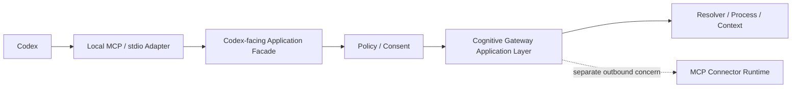
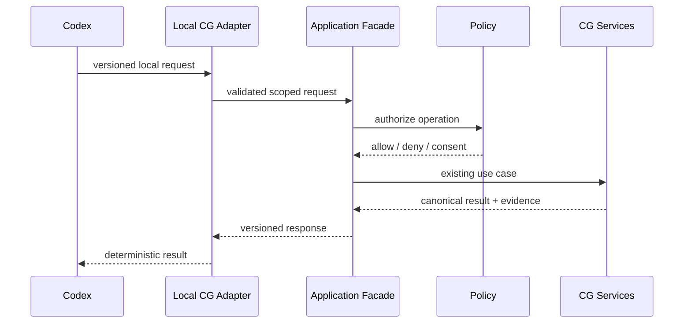

# Codex Local Integration

## Status

**Planned — EPIC-04 #126.**

EPIC-04 defines the inbound integration from Codex to Cognitive Gateway through a local, no-CG-API-key boundary.

## Architectural direction

## Boundary rules

- Cognitive Gateway does not require or store an OpenAI API key for this integration.
- Codex owns its account/session authentication.
- MCP framing remains an adapter concern.
- Codex/OpenAI SDK types cannot enter authoritative domain contracts.
- Every request is bound to explicit workspace/project/session scope.
- Provenance and sensitivity survive the boundary.
- Tool availability never implies authorization.
- Mutation/admin operations remain subordinate to CG policy and consent.
- Codex cannot grant capabilities, alter policy or directly advance process state.

## Separation from EPIC-07

EPIC-04 is **Codex -> Cognitive Gateway**.

EPIC-07 is **Cognitive Gateway -> external MCP servers/systems**.

They may share protocol infrastructure at outer adapter boundaries, but must not duplicate responsibilities or introduce protocol-specific domain models.

## Planned vertical slice

The implementation work is tracked by EPIC-04.01 through EPIC-04.10 (#236–#245).
