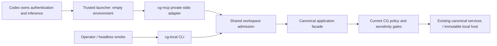

# Codex local setup and operator runbook — EPIC-04.09 #244

This guide builds and verifies the private Codex → CG stdio connection from a
clean checkout. CG requires no OpenAI API key, Codex token, model service,
PostgreSQL instance or network listener for this path. Codex manages its own
authentication and inference. Direct OpenAI API integrations use separate provider
credentials and outbound adapters; they are not an admission fallback.

## Build and bootstrap

Prerequisites: current stable Rust/Cargo supporting the workspace's Rust 2024
edition, Python 3.11+, and a POSIX environment providing `env -i` (Linux, macOS or WSL).
Native Windows launch needs a separately controlled environment-clearing launcher;
the example does not qualify that transport. Run these commands at the checkout root:

```sh
cargo build -p gateway-daemon --bin cg-mcp --bin cg-local --locked
python3 scripts/bootstrap-codex-local.py \
  --repository "$PWD" --output target/codex-local-example \
  --client-name codex --client-version 1.0
python3 scripts/check-codex-local.py --setup target/codex-local-example
```

The `codex / 1.0` pair is a reproducible synthetic fixture identity, **not a
qualified installed Codex version**. Bootstrap succeeds with a JSON object whose
`status` is `ready`, `canonical_scope` is `canonical-example`, and protocol is
`2025-11-25`. The second command ends with:

```text
Codex local smoke passed: protocol 2025-11-25, 13 tools, admitted scope, CLI/MCP results identical, no provider environment
```

The bootstrap creates a new private directory containing `admission.json`,
`request.json`, `launch.json` and `config.toml`; it never edits your Codex settings
or overwrites an existing directory. Choose a new output directory when rerunning.
The admitted resource is explicitly PUBLIC synthetic smoke evidence, derived from
the checked-in [example request](../examples/codex-local/situation.inspect.request.json).
It does not scan or admit checkout files. The
[empty admission example](../examples/codex-local/admission.example.json) shows
the configuration shape without admitting content. If using `CARGO_TARGET_DIR`
or installed binaries, pass `--bin-dir /absolute/path/to/bin` to both scripts.
Neither script installs dependencies or builds binaries implicitly.

## Configure the actual client

Identify the installed client with `codex --version`. Pin the exact name and
version it sends in MCP `initialize.clientInfo`; the displayed CLI version alone
does not establish that wire pair. Verify it in a controlled, non-sensitive client
qualification session. There is no wildcard, guessed version or silent downgrade.
Live client interoperability and its precise supported pair remain #245.

Generate a new setup using that verified pair, then copy its server table into
`~/.codex/config.toml` or a trusted project's `.codex/config.toml`. Merge the table
with existing settings instead of replacing the file. A checked-in
[configuration template](../examples/codex-local/config.example.toml) is also
available. The generated table follows
[official Codex MCP configuration](https://developers.openai.com/codex/mcp/):

```toml
[mcp_servers.cognitive_gateway]
command = "/usr/bin/env"
args = ["-i", "/absolute/path/to/cg-mcp",
  "--client-name", "codex", "--client-version", "VERIFIED_WIRE_VERSION",
  "--principal", "operator", "--workspace", "workspace-example",
  "--project", "project-example", "--binding", "binding-example",
  "--admission", "/absolute/path/to/admission.json",
  "--cwd", "/absolute/path/to/project",
  "--repository", "/absolute/path/to/project",
  "--session", "codex-session-example"]
env_vars = []
startup_timeout_sec = 10
tool_timeout_sec = 35
enabled_tools = ["cg_situation_inspect_v1", "cg_situation_assess_v1"]
```

Bootstrap uses the local absolute `env` path. Its `-i` clears inherited variables
before CG starts; `env_vars = []` alone is not an environment-clearing guarantee.
Keep credentials out of the table, admission, request and CG environment. Absolute
binary and admission paths avoid dependence on Codex's PATH or cwd. Protect the
executables and admission/configuration files against unauthorized edits.

Run `codex mcp list` to verify registration, then restart the Codex session to
initialize the server. Registration alone does not prove a successful handshake.
Use tool discovery and read `cg://runtime/health` to confirm protocol readiness;
invoke `cg_situation_inspect_v1` with the generated `request.json` envelope to
verify application access. Codex starts CG as a child process; do not start a
separate daemon or send shell output onto its protocol stdout.

## CLI fallback and effective scope

`cg-local` accepts the same ten launch options as an admitted `cg-mcp` connection.
Use the generated launch array to avoid manually changing scope or identity:

```sh
python3 - <<'PY'
import json, subprocess
from pathlib import Path
setup = Path('target/codex-local-example')
launch = json.loads((setup / 'launch.json').read_text())
binary = str(Path('target/debug/cg-local').resolve())
subprocess.run([binary, '--check'] + launch, env={}, check=True)
subprocess.run([binary, '--operation', 'situation.inspect', '--request',
                str(setup / 'request.json')] + launch, env={}, check=True)
PY
```

`--check` revalidates the admission file and reports effective workspace, project,
binding, canonical CG scope, principal, client session, mapping revision, expected
client pair, schema/protocol versions and default limits. It prints no repository
path, resource contents or credential values. `ready` means local admission
passed; it does not claim a live Codex handshake or permission for every operation.
The version field is the server's supported version, not a negotiated CLI protocol.

`--operation OP --request FILE` reads one bounded, duplicate-key-free JSON v1
envelope and returns the canonical facade response as JSON. The successful smoke
response has `status: "ok"`, `operation: "situation.inspect"`, the admitted scope,
PUBLIC source provenance and a scope trace in `explainability`. Exit codes:
0 success/check, 1 canonical facade failure, 2 setup/input failure. Diagnostics are
fixed text on stderr; rejected arguments and documents are never echoed.
`cg-local --help` documents all options. File input/output is limited to under
1 MiB and dispatch receives a 30-second cooperative application deadline.
This immutable local host provides no external dispatch; it does not qualify
hard preemption of arbitrary injected hosts or blocked CLI output pipes.

Both paths construct `CodexFacade::with_binding` through the same `admit_local`
function. Validation, sensitivity, references, scope, provenance, policy and
canonical use cases are shared. CLI fallback grants no extra authority and makes
no automatic retries. The local host enables situation inspect/assess and scoped
resource reads; other operations return `CG_UNSUPPORTED_CAPABILITY`. The CLI
operation interface accepts frozen canonical tool operations; resource reads
remain available through MCP. The unrelated `cg` declarative CLI is not this
fallback and does not establish Codex admission.

## Workspace scoping

For another project, create a separate operator directory and explicitly update
its mapping: absolute repository root, distinct workspace/project/canonical scope,
principal, session, binding and revision. Update the launch options and request
scope to match. Sibling repositories can use distinct mappings; nesting or
duplicating roots makes admission ambiguous and is rejected. `--cwd` may identify
an existing subdirectory inside exactly one admitted canonical root. Relative
paths, symlink escapes, mismatched repositories and foreign sessions fail closed.
There is no ambient current-directory or most-recent-project fallback.

Binding/session IDs are local opaque identifiers, not Codex account credentials.
For a fresh connection, provision a new binding/session in trusted admission and
launch/request configuration. Reconnecting never restarts durable tasks. Changing
resource content requires its exact canonical JSON SHA-256 digest and classified
provenance to be updated; do not admit real sensitive content merely to make a
smoke test pass. See [scope isolation](codex-scope-isolation.md) and
[secret isolation](codex-secret-isolation.md).

## Compatibility and troubleshooting

| Layer | Supported contract |
| --- | --- |
| Transport | Private newline-delimited JSON-RPC 2.0 stdio; stdout protocol only |
| MCP | Exactly `2025-11-25`; initialize then `notifications/initialized` |
| Application envelopes/resources | Frozen `schema_version: "1.0"`; canonical contract version `1.0` |
| Admission file | Integer `schema_version: 1`; strict fields and unique scope mapping |
| Client | Exact trusted name/version pair must match initialize claims; live qualification #245 |
| Discovery | 13 contracts; discoverability does not authorize or imply implementation availability |

| Symptom | Diagnostic/action |
| --- | --- |
| Bootstrap fails | `CG_BOOTSTRAP_FAILED`: build both binaries, supply an existing repository and new output directory; use `--bin-dir` for a custom target |
| Credential environment rejected | `CG_CREDENTIAL_ENV_DENIED` in CLI or fixed MCP credential diagnostic: run via `env -i`; do not dump environment values |
| Invalid MCP launch binding | Run `cg-local --check` with the same launch array; check required unique flags, admission JSON and matching identities |
| Unsupported admission schema | `CG_UNSUPPORTED_VERSION`: use admission version 1; do not downgrade a foreign configuration |
| Scope denied | `CG_SCOPE_DENIED`: verify explicit roots, unique mapping, canonical scope and matching workspace/project/binding/principal/session |
| Invalid configuration/request | `CG_INVALID_INPUT`: check strict fields, bounded JSON, duplicate keys, operation and frozen request shape |
| Client/protocol initialization rejection | Check exact wire identity and MCP version; restart with a newly admitted connection after correction |
| Resource stale/unavailable | Check revision/digest/provenance in trusted admission; unavailable/foreign/SECRET resources deliberately share sanitized errors |
| Unsupported capability | Local host lacks that service; use supported inspection operations; installing a shared host is separate work |
| Policy/sensitivity/consent/evidence denial | Preserve the canonical denial; correct trusted authority or disclosure classification, never change client claims to bypass it |
| Timeout/cancellation/lost response | Do not retry mutations; consult durable session state and reconcile uncertain dispatch through shared services |
| Transport closes | Check bounded frames, deadlines and credential-free sanitized stderr; keep stdout free of banners and shell diagnostics |

`cg-mcp --diagnostics` prints default runtime limits to stderr without admission.
For MCP calls, retain generated correlation IDs and typed failure classes from
sanitized stderr, not raw payloads or auth stores. Runtime health reports counters
and bounds without paths or resource contents. Optional `--runtime-limits FILE`
belongs to MCP and is documented in [runtime operation](codex-runtime.md);
CLI checks report its own defaults rather than claiming to inspect that file.

## Architecture and verification



Regression commands from the checkout root:

```sh
cargo test -p gateway-daemon --test codex_local_cli --test codex_isolation --test local_mcp --locked
cargo test -p gateway-application --test codex_facade --locked
python3 -m unittest discover -s tests/codex-local
python3 scripts/check-local-mcp-protocol.py
cargo fmt --all --check
cargo clippy --workspace --all-targets --locked -- -D warnings
bash scripts/check-architecture.sh
```

The smoke checker exchanges frames one at a time before closing stdin, verifies
initialization, 13-tool discovery, successful admitted inspection and exact
CLI/MCP canonical response equality in empty environments. It uses no Codex
account or provider. Automated tests cover setup diagnostics, foreign scope,
policy and classification denial, credential/duplicate input rejection and
bootstrap configuration. This evidence establishes local reproducibility; it
does not claim live Codex qualification, which remains #245.

| #244 acceptance criterion | Evidence |
| --- | --- |
| Clean setup needs no OpenAI key in CG | Bootstrap/check subprocesses use empty environments; no provider dependencies or calls |
| MCP and CLI share the canonical facade | Shared `admit_local`, `CodexFacade::with_binding`, exact response parity smoke |
| Reproducible smoke tests | Build/bootstrap/check commands above and headless CLI/MCP protocol exchange |
| Actionable non-sensitive diagnostics | Fixed CLI/bootstrap/check codes; malformed input, credentials and foreign scope regression tests |
| Example configuration has no secrets | Empty admission and TOML templates; PUBLIC synthetic sample; inherited fake key never enters artifacts |
| Effective workspace/protocol visible | `cg-local --check` reports the bound identities and supported protocol/schema versions |

Verification on 2026-10-10: workspace tests passed 780 tests with three existing
optional tests ignored. Formatting, workspace Clippy, architecture guard and 17
architecture tests, 11 contract tests, independent 13-tool MCP conformance and
operator bootstrap/parity tests passed. All 13 files in the local MCP coverage
gate exceed 95%; `cg-local` measured 96.46% and shared workspace admission 97.54%.
Local reports are `target/epic-04-09-workspace-tests.log`,
`target/epic-04-09-clippy.log` and `target/epic-04-09-coverage.json`. The release
manifest now includes the operator tests and CLI in the existing coverage gate.
This verification does not claim execution of the separate full release gate.
