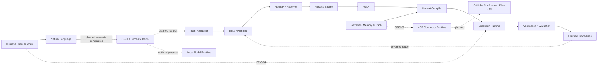

# Current Architecture State

**Reference date:** 2026-10-04

This document is the compact status map for the current Cognitive Gateway architecture. It distinguishes implemented contracts from planned architecture so that issue descriptions, arc42 and code are not accidentally treated as equivalent maturity.

## Status legend

- **IMPLEMENTED** — present in the default branch with executable code/tests or an established shipped contract.
- **PARTIAL** — foundations exist, but the complete vertical slice is not yet implemented.
- **PLANNED** — defined in an Epic/issue and part of the target architecture, but not yet a completed runtime capability.

## Current system map

## Capability status

| Area | Status | Notes |
| --- | --- | --- |
| Typed domain model / ExecutionContextIR | IMPLEMENTED | Versioned domain and serialization contracts exist. |
| Agent / Skill / Capability registry | IMPLEMENTED | Deterministic catalog and resolution foundations exist. |
| Process engine | IMPLEMENTED | Deterministic process semantics and integration proof exist. |
| Intent / Situation / declarative planning | IMPLEMENTED | CG-06 / CG-07 contracts and application flow are documented and tested. |
| Resolver / explainability | IMPLEMENTED / PARTIAL | Major CG-08 contracts exist; acceptance remains tied to documented integration constraints. |
| Policy and inspect/mutate separation | IMPLEMENTED | Policy remains the authority boundary for executable capability use. |
| Context compiler | IMPLEMENTED | Provider-independent context construction is available. |
| Retrieval / vector / graph / memory | IMPLEMENTED | CG-15 through CG-20 foundations are present. |
| Closed-loop execution | IMPLEMENTED | Bounded reassessment/replanning flow exists. |
| Parallel task execution | IMPLEMENTED | CG-28A bounded parallel scheduling is present. |
| Learned procedure domain contracts | IMPLEMENTED | CG-21 foundation added on 2026-10-03. |
| Experience normalization and pattern inspection | IMPLEMENTED | CG-22 correlates governed, verified outcomes and supports PostgreSQL backed inspection; it creates candidates without executable authority. |
| Learned procedure discovery/promotion/reflex runtime | IMPLEMENTED (governed reference runtime) | CG-21 through CG-25 and CG-30 demonstrate experience → detected pattern → evaluated procedure → governed promotion → reflex, fallback and rollback. |
| CGSL / SemanticTaskIR | PLANNED | EPIC-05 #177 defines the formal semantic layer and compiler. |
| Natural-language-to-IR compiler | PLANNED | Rust parser/compiler work is under EPIC-05, including #186 and related items. |
| Optional SLM semantic interpreter | PLANNED | EPIC-05.11 consumes model adapters; model output is never authoritative. |
| Local SLM/LxM runtime | IMPLEMENTED (reference service) | CG-27.01: separate CPU-first Ollama/Python containers, Rust port/adapter, immutable profiles, qualification, promotion and rollback. Full SemanticTaskIR interpretation remains separate EPIC-05.11 work. |
| Local cognitive signal benchmarks | IMPLEMENTED | CG-27: replaceable four-task proposal adapter, versioned synthetic dataset, fixture and Ollama CPU/GPU harness, per-sample provenance and explicit failure/fallback evidence. |
| Governed offline learning pipeline | IMPLEMENTED (contracts and reference coordinator) | CG-28 validates signals, assembles scoped/versioned datasets, gates offline jobs/evaluation and journals canary/rollback. Concrete CPU feature/training/CV/calibration worker, PostgreSQL release journals and current-version inference/rollback are implemented; see complete EPIC-03 acceptance. |
| Distributed cognitive worker fabric | IMPLEMENTED (contracts and local reference) | CG-29: immutable scoped snapshots, bounded queue/retries, fenced leases, provenance and a local worker adapter. PostgreSQL coordination preserves leases/fencing/idempotency across restart; Linux process and isolated container resource enforcement are implemented. Swarm/Kubernetes transport remains optional. |
| Qwen3-8B reference profile | PLANNED | Reference candidate only; not a mandatory product dependency. |
| General provider-independent model invocation | PLANNED | EPIC-06 #178 owns the general model invocation boundary. |
| MCP connector/plugin runtime | PLANNED | EPIC-07 #223 owns external MCP server integration. |
| GitHub MCP connector | PLANNED | Reference connector under EPIC-07. |
| Codex -> CG local no-key MCP | PARTIAL | #238 implements [private stdio lifecycle/discovery](local-mcp-server.md); #236 / ADR-020 define trust. [Application facade](codex-application-facade.md) #239 is implemented and injectable. Standalone admitted host wiring remains #240; default tool calls return unsupported. |

## Normative boundaries

1. **Deterministic core before probabilistic assistance.** Model output may propose classifications, mappings or content, but deterministic contracts validate it.
2. **MCP is transport/capability plumbing, not authority.** Discovery never grants permission.
3. **Retrieval is information, not authority.** Retrieved content keeps provenance/trust/sensitivity metadata.
4. **CGSL describes task meaning; Process IR describes controlled execution.**
5. **Execution/runtime providers are replaceable.** Provider SDKs and protocol types stay outside authoritative domain contracts.
6. **Local model runtime is replaceable and independently deployable.** A concrete Qwen/Ollama combination is an implementation profile, not a core dependency.
7. **Learned procedures are governed artifacts.** Experience does not become executable authority merely because it succeeded previously.

## Issue anchors

- EPIC-04 #126 — Codex local no-key integration.
- EPIC-05 #177 — CGSL, SemanticTaskIR and contextual semantic resolution.
- EPIC-06 #178 — provider-independent model invocation.
- EPIC-07 #223 — MCP connector/plugin runtime.
- EPIC-03 #114 — adaptive cognitive runtime and learned procedures.
- CG-28 #219 — governed learning signals and offline training pipeline.
- CG-27 #218 — local SLM/LxM adapter and benchmark framework.
- CG-27.01 #249 — upgradable containerized local model service.
- CG-29 #220 — distributed cognitive worker fabric.

This file should be updated whenever a planned boundary becomes implemented or a new authoritative architectural boundary is introduced.
