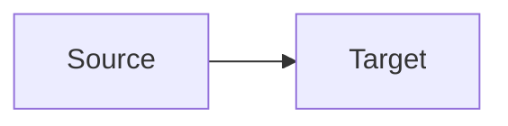

# Diagram Conventions

## Status

**Normative documentation convention — 2026-10-03.**

## Canonical rule

All architectural, technical, behavioral, lifecycle, deployment and data-flow
diagrams in canonical Cognitive Gateway documentation use **Mermaid** as the
version-controlled source representation.

Example:

## Text blocks remain appropriate for

- directory and file trees;
- CLI commands and terminal output;
- literal schemas, record layouts and data examples;
- configuration examples;
- grammar and pseudocode where graph semantics add no value;
- compact mappings or formulas that are primarily textual rather than diagrams.

## Rendered image assets

PNG/SVG assets may remain for presentation, branding or high-level visual
communication. When an image represents normative technical architecture, a
Mermaid source equivalent must exist in canonical documentation so the
technical relationships remain reviewable, diffable and reproducible as text.

## Maintenance rule

When a technical relationship changes, update the Mermaid source in the same
change as the corresponding architecture text or implementation. New ASCII
box/arrow diagrams must not be introduced into canonical documentation.
