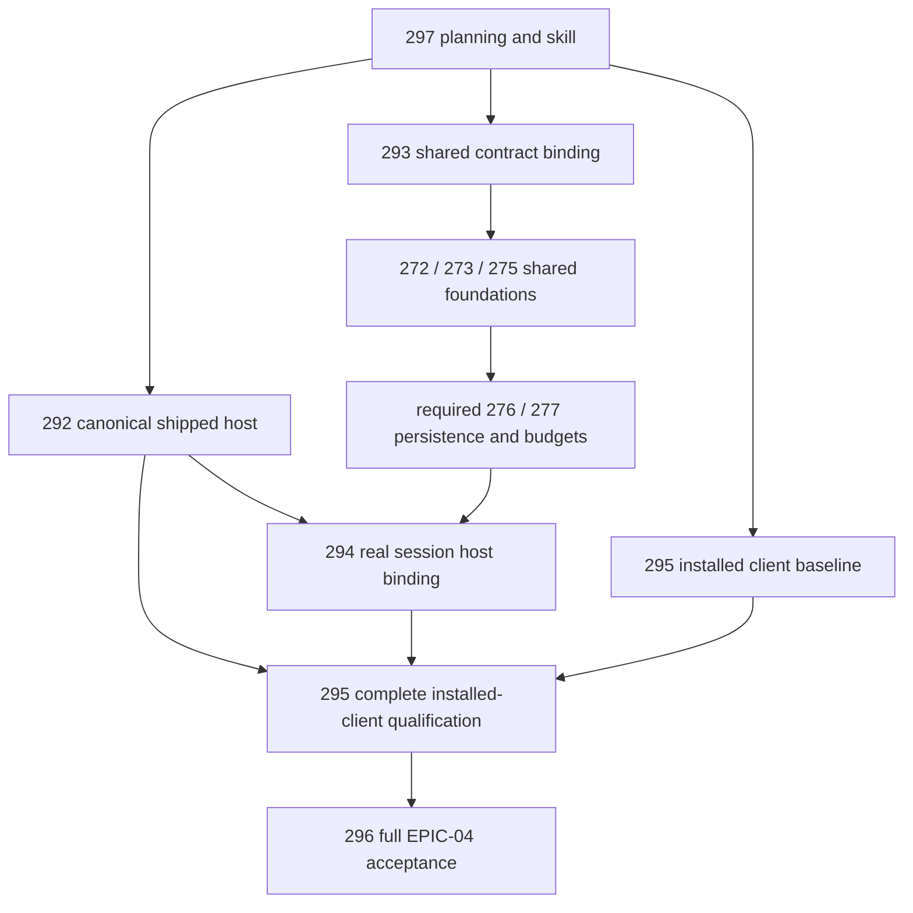

# EPIC-04 delivery-gap review and implementation plan

Current full-parent acceptance is governed by [EPIC-04 acceptance](epic-04-acceptance.md).
Shared structured services and installed-client lifecycle proof are delivered;
older evidence below retains its historical scope. Parent #126 remains NOT_COMPLETE.

Date: 2026-10-10. Inspected baseline: `4d28315` (merged #291).
Parent: [EPIC-04 #126](https://github.com/MatthiasBurger-Coder/Cognitive-Gateway/issues/126).
This plan extends the existing inbound integration; it does not replace EPIC-08
or qualify its complete model/connector runtime.

## Current #294 runtime delivery

The registered structured context-artifact baseline is **QUALIFIED**. The shared
application coordinator and real clarification/consent services, required
PostgreSQL journal/recovery and cumulative budgets are implemented under their
existing EPIC-08 owners and used by both shipped local executables. GAP-04 through
GAP-09 have shared-service, actual PostgreSQL and executable evidence for this
baseline: seven application runtime tests, five database tests and eight actual
CLI/MCP scenarios pass, with >=95% coverage for all 14 changed executable
production files. See [runtime evidence](evidence/EPIC-04.13-shared-runtime.json)
and [configuration/recovery](shared-session-implementation.md).

The intake assessments and matrix below retain the inspected historical baseline.
They do not describe missing structured services in the current delivery.
Installed Codex-client session qualification (#295) now has its own
[installed-client evidence](codex-installed-client-qualification.md). Parent
reconciliation (#296) and complete EPIC-08/model/connector acceptance remain separate.

## Three Amigos intake gate (historical baseline)

The user explicitly requested gap closure, a prior Three Amigos review, issues
before multi-step implementation and an improved skill. The original named skill
was found in the adjacent Tiny-Swarm-World checkout. Its four perspectives were
applied as sequential role passes by one agent, not independent reviewers.
Target governance is `.agents/AGENTS.md` (DEVELOPMENT / FULL_PATH); quality
commands come from `scripts/quality-gates.json` and `.github/workflows/rust.yml`.
No workflow engine or Python-specific product architecture is imposed on CG.

- Requirement engineer: #126 includes nineteen original criteria plus five
  architecture-integration additions. All ten original child issues are closed,
  but actual product completion is not established. The user's three gaps are
  required delivery work, not optional enhancements. Natural-language/model and
  external connector completion remain with their owners.
- Architect: `LocalCodexHost::authorize` admits only situation inspection,
  assessment and resource reads. Shared #272/#273/#275 services are absent;
  `CodexHost::session` defaults to unsupported. Canonical use cases already exist,
  so reusable strict CLI mapping can wire them into the host. The application
  layer must own shared session state; stdio must not own a second coordinator.
- Automation developer: Rust remains authoritative. Python may bootstrap,
  exercise the installed client and retain evidence. Installed `codex-cli
  0.162.1` exposes `mcpServer/tool/call` in its generated app-server schema;
  availability alone is not execution proof. Use an isolated configuration,
  no inference turn, no auth transfer and `/usr/bin/env -i` for CG.
- Tester/evidence reviewer: component fixtures prove computation and adapter
  projection, not shipped-host availability or shared lifecycle. Production
  launcher tests, real service transitions and actual installed-client
  invocation must be separate required evidence. Existing >=95% coverage and
  architecture guards remain in force.
- Dependency/deadlock pass: canonical host wiring and baseline client probing
  can proceed independently; shared-session consumers await the shared contract
  and foundation gates. Run file-mutating slices sequentially. #279 system proof
  remains separate. Scope/policy/consent cannot come from client/model content.

Intake gate at the inspected baseline: #293 contract definition is **READY_FOR_WORKFLOW** with the
user-selected artifact goal. #294 runtime binding is **BLOCKED** until #272
typed contracts and executable #273/#275/#276/#277 foundations qualify.
This is authorized prerequisite work, not a request for repeated implementation
permission. #292, #293, baseline #295 investigation
and #297 are ready for their own bounded scopes. #294 and final #296 cannot
claim readiness/completion from placeholder host projections.

## Accepted scope and progress

The user explicitly accepted structured tasks using the existing Rust services,
with Semantic/model/connector paths unsupported. On 2026-10-10 the user selected
a verified context artifact as the explicit first task goal. ADR-021 and the
normative shared specification now fix typed ownership, exact interactions, recovery requirements and a separate v2 boundary.
See [shared session specification](shared-session-contract.md).
No shared coordinator, pending-interaction runtime or durable recovery is
claimed by the completed canonical and client work.

- #292: shipped canonical host implemented; five executable scenarios and all
  nineteen existing declarative CLI regressions passed. New host/mapper/pipeline
  were added to the >=95% per-file coverage gate; first measurement passed.
- #295: installed Codex 0.162.1 invoked inspection, resolve, explain and compile
  with complete CLI envelope parity. This exposed and repaired explicit protocol
  2025-06-18 and discovery `_meta` incompatibilities. The extended probe now
  qualifies all six shared-session tools, exact v1/v2 catalogs, verified evidence,
  consent/clarification, explicit cancellation, EOF/restart, CLI inspection
  parity and refusal paths. See [installed-client qualification](codex-installed-client-qualification.md).
  Parent acceptance remains separate; the report retains EPIC-04 NOT_COMPLETE.
- #297: adapted skill created and structurally validated. [Scenario review](three-amigos-skill-validation.md)
  records decisions on real failures without inventing independent reviewers.
  The bounded local candidate now includes repository authority/quality-path
  navigation, an explicit prerequisite ledger and candidate-bound evidence rules;
  all six #297 criteria are traced in that report. This does not qualify parent Done.
- #293: [shared contracts](shared-session-contract.md) specified with accepted
  ADR-021, explicit artifact verification and the seven-row requirement matrix.
  This completes contract definition only; #272 types and #273/#275/#276/#277
  runtime gates remain required before #294 can expose versioned session operations.

## Historical intake requirement and evidence matrix

This supplements all nineteen parent rows in `codex-release-qualification.md`;
their component evidence is retained, not upgraded to product evidence.

| ID | Requirement / source | Actual path and owner | Dependency state | Required evidence | Intake status |
| --- | --- | --- | --- | --- | --- |
| GAP-01 | Product resolve, parent inspect/resolve/explain/context scope | cg-mcp/cg-local -> LocalCodexHost -> existing resolver | CLI canonical mapping implemented, host unsupported | EXECUTABLE resolve, canonical determinism and parity | OPEN |
| GAP-02 | Product explain with exact pinned resolution | Same host -> explain_resolution | canonical service exists; product host unsupported | EXECUTABLE explanation plus stale-reference negative | OPEN |
| GAP-03 | Product context compilation, mode/profile and provenance | Same host -> ContextApplication/PolicyApplication | trusted projection/policy mapping exists only in CLI and injected hosts | EXECUTABLE authorized compile and denied/stale cases | OPEN |
| GAP-04 | Single shared start/inspect application API, parent integration additions | EPIC-08 #272/#273, inbound is a projection | contracts/coordinator PLANNED, no service | SHARED_SERVICE actual scoped task lifecycle | BLOCKED on contract/foundation delivery |
| GAP-05 | Real clarification pause/reply/resume | #275 interaction / EPIC-05 semantic owner | pending projections only; semantic paths absent | actual service pause and validated reply, duplicate/expiry/scope negatives | BLOCKED |
| GAP-06 | Consent pause/approve/withdrawal, exact revision-bound action | #275 plus existing CG Policy/consent authority | no shared pending-interaction runtime | actual trusted-consent service and changed-policy/action negatives | BLOCKED |
| GAP-07 | Continue uses current scope/policy/consent and final verification | #273/#275, existing CG-14 / Process / Policy / verification | shared services absent | actual continuation, stale/replay negatives, verified result reference | BLOCKED |
| GAP-08 | Explicit cancellation distinct from disconnect | shared lifecycle #273/#277; adapter transports only | transport cancel bounded, task cancel unsupported | real cancel + EOF + reconnect scenarios | BLOCKED |
| GAP-09 | Supported reconnect/restart preserves pending state and consumed budgets | #276 persistence/recovery, #277 cumulative limits | PLANNED, CG-14 diagnostic JSON is not a checkpoint | restart/service evidence and concurrent-owner/duplicate-dispatch negatives | BLOCKED |
| GAP-10 | Actual installed Codex can invoke CG without a CG key | installed CLI/app-server -> env -i -> cg-mcp | CLI 0.162.1 available; no retained invocation evidence | INSTALLED_CLIENT version/identity/protocol/discovery/call/parity | OPEN |
| GAP-11 | Strict scope/provenance/sensitivity/policy and existing services remain authoritative | current facade, resolver/context/policy services and admitted host | component gates passed | existing negatives plus newly shipped production paths | PARTIAL |
| GAP-12 | All applicable gates and >=95% changed-production coverage | scripts/quality-gates.json / coverage manifests | existing component proof retained | actual changed-file measurement and gate logs | PARTIAL |
| GAP-13 | Complete parent criteria and source-bound release/closure evidence | #296 / #126; #279 separate system owner | report explicitly NOT_COMPLETE | full acceptance matrix and status/limitation reconciliation | OPEN |
| GAP-14 | Better planning/skill from demonstrated causes | .agents/skills/three-amigos-requirement-gatekeeper | original skill present only in TSW | structure validation plus realistic readiness/closure cases | IN_PROGRESS |

## Effort and sequencing

Estimates are provisional engineer-days including implementation, meaningful
negative tests, documentation and applicable qualification/coverage. They are
not elapsed calendar time, measured productivity or a delivery commitment.
Confidence is medium for mapping/client work and low for sessions until the
specified #272/#273/#275/#276/#277 foundations qualify. #293 fixes the contract and product boundary; it supplies no runtime execution evidence.

- [292 — EPIC-04.11: Wire canonical resolve, explain and context compilation into the shipped local host](https://github.com/MatthiasBurger-Coder/Cognitive-Gateway/issues/292): 4–7 engineer-days.
- [293 — EPIC-04.12: Define the Codex binding to shared session contracts and trusted interaction authority](https://github.com/MatthiasBurger-Coder/Cognitive-Gateway/issues/293): 2–4 engineer-days.
- [294 — EPIC-04.13: Bind local Codex session operations to the real shared coordinator and pause-resume services](https://github.com/MatthiasBurger-Coder/Cognitive-Gateway/issues/294): 10–18 engineer-days.
- [295 — EPIC-04.14: Qualify the installed Codex client against the delivered local no-key path](https://github.com/MatthiasBurger-Coder/Cognitive-Gateway/issues/295): 2–4 engineer-days.
- [296 — EPIC-04.15: Enforce full EPIC-04 acceptance and prevent component-only closure](https://github.com/MatthiasBurger-Coder/Cognitive-Gateway/issues/296): 2–3 engineer-days.
- [297 — EPIC-04.16: Improve Three Amigos planning to detect delivery and qualification gaps](https://github.com/MatthiasBurger-Coder/Cognitive-Gateway/issues/297): 1–2 engineer-days.

Total provisional effort: **21–38 engineer-days**. The session range includes
minimum shared contracts/coordinator/interaction and persistence needed for the
supported inbound lifecycle; it excludes complete EPIC-05/06/07/08 product
qualification. If real semantic clarification or external effects are necessary
for the selected baseline, re-estimate those owner prerequisites explicitly;
never substitute a fake pause or observation.

Ordered dependency graph:

Storage decisions and exact pending-interaction payloads belong in #272/#293
before #294. Prefer existing application services and existing journal patterns;
no private cross-plane storage access. Define rollback to unsupported session
operations and inspection-only admission; do not drop required parent criteria.
Qualification must identify the exact candidate and substituted inputs.

## Why the gaps arose

Demonstrated from the checked-in implementation and issue/PR evidence:

1. **Surface vs composition root.** The facade/catalog expose operations and tests
   inject capable hosts, while the product launcher builds an inspection-only
   `LocalCodexHost`. Port and test completion did not entail product wiring.
2. **Unimplemented shared foundations.** The late parent architecture review
   requires #272/#273 lifecycle reuse. Those services are PLANNED. Tests return
   fixed session projections without a coordinator. The original implementation
   order did not include delivery of these later dependencies.
3. **Client identity substituted.** The qualification client is a synthetic
   `codex / 1.0`, not the installed binary. Protocol conformance and real
   executable subprocesses were mistaken for sufficient client qualification.
4. **Closure boundary mismatch.** PR #291 explicitly says shared-session lifecycle
   remains follow-on work, yet contains `Closes #245`. The report says
   `epic_04_status: NOT_COMPLETE` and that it does not close #245. Issue state
   therefore contradicts the declared evidence boundary. All-children-closed is
   not a valid parent acceptance proof.
5. **Late acceptance additions.** The 2026-10-04 parent additions introduced
   start/continue/cancel/shared lifecycle requirements beyond the original
   ten-item dependency graph. Child and parent acceptance scopes diverged.

Plausible contributing planning weaknesses, not proven historical motives:
role review focused on interfaces/tests rather than installed entrypoints;
prerequisite implementation was not included in bridge effort; no mechanical
closure check reconciled report limitations with `Closes` statements; the
TSW-specific skill was not discoverable in this repository. The improved local
skill checks these patterns without claiming that it was used by earlier PRs.

Source evidence: #126 current acceptance; #271/#272/#273/#275 actual planned
state; #291 merged PR description; `codex_workspace.rs` operation whitelist;
`codex/ports.rs` unsupported defaults; `codex_qualification.rs` ProjectionHost;
`qualify-codex-local.py` machine status/limitations; `codex-release-qualification.md`.

## Verification of this planning change

The plan and skill alone establish no runtime behavior. Implementation evidence
for the independently delivered slices is listed above; later full acceptance
must reconcile the complete matrix with the candidate reports. The
baseline audit passed 3 Rust bridge tests and 5 executable qualification tests;
existing component report gates were all green and minimum coverage 96.12%.
That evidence retains its component scope.
