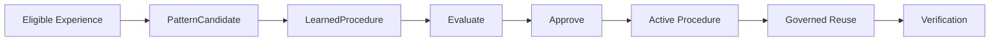
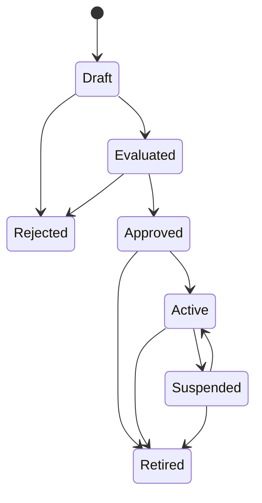

# Learned Procedures and Governed Procedural Learning

## Status

**Foundation implemented — CG-21 domain contracts landed on 2026-10-03.**

The current implementation establishes model-independent contracts for learning candidates and learned procedures. It does **not** mean that the complete autonomous discovery/promotion/reflex vertical slice of EPIC-03 is finished.

## Purpose

Cognitive Gateway may reuse validated execution experience without turning historical success or probabilistic output into authority.

## Implemented CG-21 foundation

The domain now includes contracts equivalent to:

- `SituationFingerprint` and typed fingerprint signals;
- `ExperienceBasis` linked to governed memory eligibility/provenance/evaluation;
- `PatternCandidate`;
- `ProcessReference`;
- `ProcedureStep` referencing process, capability and policy identities;
- `LearnedProcedure` with canonical content digest;
- explicit required observations/evidence/verification evidence;
- explicit fallback behavior;
- `ProcedureState` lifecycle;
- append-only `ProcedureTransition` and `ProcedureLifecycle`;
- strict serialization/validation and canonical ordering constraints.

## Authority model

A candidate or learned procedure does not create policy authority.

A procedure references existing process/capability/policy identities; those existing authorities remain responsible for whether a step is legal and allowed.

Historical experience is evidence for learning, not permission.

## Lifecycle

The implemented lifecycle allows governed transitions such as:

Transitions are explicit, correlated to a decision and actor/provenance, and projected append-only for a procedure version.

## Immutability and replay

A learned procedure version has canonical serialized content and a SHA-256-derived content digest. This allows exact identity/replay checks and prevents silent mutation of a previously evaluated procedure version.

## Relationship to EPIC-03

EPIC-03 #114 is broader. CG-22 adds governed pattern inspection and [CG-23](procedure-evaluation.md) adds validation/replay/simulation. [CG-24](procedure-promotion.md) adds promotion governance, registry, canary, supersession and rollback. Further work covers deterministic reflex fast paths, fallback, routing and continuous feedback.

CG-21 provides the domain foundation for that future runtime behavior; it should not be described as a completed self-learning system.
