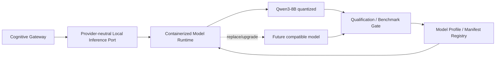

# Local Model Runtime and SLM/LxM Boundary

## Status

**Planned — CG-27 #218 and CG-27.01 #249.**

The local model subsystem is an optional cognitive accelerator. It is not part of the deterministic authority core and Cognitive Gateway must remain usable without it.

## Architecture



## Core rules

- The core depends on a stable inference port, never on a concrete model/runtime SDK.
- The runtime is independently deployable, preferably Docker-first for the reference deployment.
- CPU-only operation is a required baseline; optional GPU acceleration must not change domain/application contracts.
- Model files live outside the Cognitive Gateway image and may use a persistent volume.
- Model output is proposal/signal data and cannot mutate Process, Policy or canonical semantic state directly.
- Runtime failure must degrade deterministically.

## Model profiles

A model profile records at least:

- logical role;
- model family/version/revision;
- artifact digest;
- runtime and runtime version;
- quantization;
- supported input/output contracts;
- structured-output support;
- context limit;
- hardware requirements;
- prompt/template version;
- qualification state and provenance.

Cognitive Gateway should resolve logical roles such as `semantic-interpreter`, not hard-code a concrete model throughout the core.

## Reference model

Qwen3-8B quantized is the planned first reference candidate for structured semantic interpretation. It is not a mandatory dependency and may be replaced by a future compatible model after qualification.

## Upgrade lifecycle

```text
discover/pull
  -> register candidate
  -> conformance + benchmark
  -> qualify
  -> promote active
  -> monitor
  -> rollback if required
```

A future model generation should be introduced by model artifact/profile/configuration plus qualification, not by changing Cognitive Gateway domain contracts.

## Relationship to other Epics

- **EPIC-05.11** may use this runtime for optional natural-language semantic proposal generation.
- **EPIC-06 #178** owns general provider-independent model invocation and prompt/runtime rendering.
- **CG-27 / CG-27.01** own local inference deployment, model manifests, benchmarks, qualification and rollback.

The SLM is therefore an adapter/service, not the Cognitive Gateway brain or authority source.
