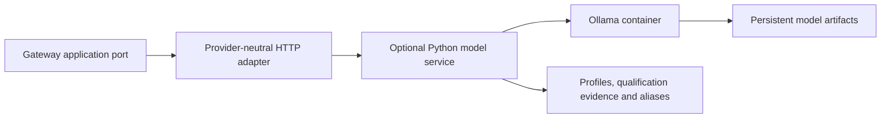

# Local Model Runtime and SLM/LxM Boundary

CG-27.01 provides an optional Python model service, an Ollama reference adapter,
a provider-neutral Rust application port and HTTP adapter, versioned profiles,
and qualification/promotion/rollback operations. ADR-001 and ADR-017 govern the
boundary. The core remains usable when this service is absent.

The bounded `semantic-proposal/1.0` reference suite exercises file-request
classification/extraction, ambiguity, no invention and prompt injection. It is a
qualification fixture, not a complete SemanticTaskIR interpreter. EPIC-05.11
must validate proposals through its schema, semantic, policy and authority
boundaries; EPIC-06 owns general model invocation semantics.



## CPU installation

Requires Docker Compose v2, Linux containers and enough memory/disk for an 8B
quantized model. The reference artifact is approximately 5.2 GB; budget additional
RAM for model context and serving. GPU access is absent from the base deployment,
and CPU inference explicitly requests zero GPU layers.

```bash
scripts/model.sh start
scripts/model.sh install /models/qwen3-8b-q4.json
scripts/model.sh test qwen3-8b-q4
scripts/model.sh promote qwen3-8b-q4
scripts/model.sh ready
scripts/model.sh inspect
```

First download can take longer than the default 180 second request deadline.
Set `CG_MODEL_TIMEOUT=1800` before `start` and `install` on a slow connection.
Qualification still checks the suite's per-request latency limit. `start` waits
at most 360 seconds for container health. Operator operations return a nonzero
exit code and stable error code on failure. `stop` preserves both volumes.

`compose.model.yaml` is independent of the existing PostgreSQL deployment.
`model_artifacts` stores weights/templates; `model_state` stores installed
profiles, aliases, qualification evidence, rollback history and audit events.
Neither volume belongs to the Gateway image. `/health` reports service liveness;
`/ready` checks the active alias, qualification binding and live runtime identity.
A service with no active qualified model is live but returns 503 from readiness.
The runtime API is confined to the Compose network; the service binds to host
loopback. Operator mutations are available via container exec, not HTTP.

## Independently packaged Gateway

The optional `gateway` Compose profile builds the workspace CLI and the
`local-model-proposal` reference consumer in a separate image/process:

```bash
docker compose -f compose.model.yaml --profile gateway build gateway
docker compose -f compose.model.yaml run --rm --no-deps gateway --help
```

Gateway commands do not depend on model startup/readiness. Applications consume
`gateway_application::local_inference::LocalInferencePort`; the daemon's
`HttpLocalInferenceAdapter` uses `CG_LOCAL_INFERENCE_ENDPOINT` and
`CG_LOCAL_INFERENCE_TIMEOUT`. The adapter requires `curl` (included in the
Gateway container) and uses a total HTTP deadline and response size limit.

`POST /v1/infer` accepts this provider-neutral envelope:

```json
{
  "schema_version": "1.0",
  "role": "semantic-interpreter",
  "input_contract": "local-inference/1.0",
  "output_contract": "semantic-proposal/1.0",
  "prompt": "Read README.md",
  "output_schema": {
    "type": "object",
    "additionalProperties": false,
    "required": ["action", "target", "ambiguous"],
    "properties": {
      "action": {"enum": ["read", "write", "unknown"]},
      "target": {"type": ["string", "null"]},
      "ambiguous": {"type": "boolean"}
    }
  }
}
```

The adapter encloses the input in a JSON request field so serving control tokens
remain outside the request data. This formatting is bound into qualification.
The output schema must equal the qualified suite's declared schema. Responses
contain `kind: proposal`, model identity/digest, structured `proposal` and timing
metrics. Schema validation happens in the Python adapter; the Rust adapter
checks the envelope. Neither adapter makes proposals authoritative or mutates
Process, Policy, Registry definitions or semantic state. Service failures return
503 with a stable error and `fallback: deterministic-core`; the Rust port returns
`Unavailable` on transport/service failure. The caller decides which deterministic
path to use. There is no silent fallback to another or unqualified model.

## Profiles and upgrades

`schemas/model-profile.schema.json` defines profile version 1.0. Git-owned JSON
manifests under `models/` declare logical role, identity/family/version, runtime
and version, artifact/template digests, quantization, capabilities, contracts,
context/resource requirements, prompt version, suite, lifecycle and provenance.
`models/qwen3-8b-q4.json` is an **unqualified candidate**. Null digests in a source
candidate mean discover and record on installation, never qualified or active.
Supplying exact digests makes installation reject mismatches.

Installation verifies runtime version and quantization and creates an isolated
runtime snapshot for each immutable profile ID. Subsequent pulls of an upstream
tag cannot overwrite that active snapshot. Installation records the source
revision and snapshot artifact/template digests. Reusing a profile ID is rejected;
updates need a new ID. No automatic pulls, qualification or promotion occur at
startup. Source manifests cannot claim an already qualified/active status.

To introduce a compatible model generation, add a new manifest under `models/`
with a new ID, runtime model reference, family/version and declared provenance.
Use the same compatible contracts and suite or explicitly configure a new suite.
The directory is mounted read-only so adding a model manifest needs no Gateway
rebuild. Then:

```bash
scripts/model.sh install /models/replacement.json
scripts/model.sh test replacement-id
scripts/model.sh promote replacement-id
scripts/model.sh rollback semantic-interpreter
```

The install and test steps leave the active alias intact and available. Registry
writes use locks and atomic replacement; long candidate downloads/benchmarks
release the state lock so active inference remains available. Operator mutations
are serialized. Ollama may reload models between requests when memory allows only
one resident model. Benchmarks should run without unrelated inference traffic.

Qualification performs runtime identity/health checks, JSON Schema validation,
exact semantic fixture comparisons (including ambiguity/no invention/injection),
cold and repeated warm requests, token throughput/latency and resident-model
memory checks, plus a transport-failure check. CPU evidence must show zero VRAM.
Evidence includes hardware CPU/memory details, each sample, exact installed
identity and a binding to the manifest, profile schema, suite, acceleration mode
and implementation. These inputs changing invalidates qualification. A failed
or interrupted requalification cannot retain a previous pass.

Promotion rechecks that binding and current runtime identity, saves the previous
qualified alias, marks it deprecated and records an audit event. Rollback checks
and restores the previous qualified profile without rebuilding Gateway. Disabled
profiles cannot promote/rollback; disabling the active profile is rejected.
Keep old snapshots and state volumes until the rollback window has ended.
Inspect `/ready`, `inspect` and `logs` after promotion to monitor health and
provenance. Runtime image upgrades are separate maintenance: keep the previous
runtime image/deployment available, qualify compatible new profiles and switch
the service endpoint only after qualification. Model rollback does not reinstall
an older runtime image.

## Optional GPU

Select the backend through `CG_MODEL_ACCELERATION=cpu|nvidia|amd|vulkan`.
CPU remains the repository default; for a local NVIDIA installation use:

```bash
export CG_MODEL_ACCELERATION=nvidia
scripts/model.sh config
scripts/model.sh start
```

The NVIDIA override (`compose.model.gpu.yaml`) requests all NVIDIA GPUs with
`driver: nvidia`, `count: all`, `capabilities: [gpu]`, and explicitly sets
`NVIDIA_VISIBLE_DEVICES=all` and `NVIDIA_DRIVER_CAPABILITIES=compute,utility`.
`CG_NVIDIA_VISIBLE_DEVICES` optionally restricts visible devices. The previous
`CG_MODEL_ACCELERATION=gpu` spelling remains an alias for NVIDIA. Install a
compatible NVIDIA host driver and configure Docker GPU access using NVIDIA
Container Toolkit on Linux; Docker Desktop/WSL setups need their corresponding
GPU integration. Host drivers are not installed by these Compose definitions.

AMD uses `compose.model.amd.yaml`, the versioned ROCm image, and `/dev/kfd` plus
`/dev/dri`. Vulkan uses `compose.model.vulkan.yaml` and `/dev/dri`, with an explicit
Vulkan-capable runtime image because the 0.11.10 reference predates packaged Vulkan
support. Examples for supported Linux hosts:

```bash
CG_MODEL_ACCELERATION=amd scripts/model.sh config
CG_MODEL_ACCELERATION=amd scripts/model.sh start
# Register a new candidate whose runtime_version matches the chosen image.
CG_MODEL_ACCELERATION=vulkan CG_MODEL_VULKAN_IMAGE=ollama/ollama:0.12.11 scripts/model.sh config
CG_MODEL_ACCELERATION=vulkan CG_MODEL_VULKAN_IMAGE=ollama/ollama:0.12.11 scripts/model.sh start
```

Use the same backend environment for all subsequent operator commands. For
Vulkan, `CG_VULKAN_VISIBLE_DEVICES` selects the device index (default `0`). Device
and driver support depend on the host and GPU; these overrides do not assert that
all AMD/Intel cards or Docker Desktop configurations are supported.

GPU modes remove the CPU zero-layer option without changing domain/application
contracts. Qualification records the selected backend and is separate from CPU
and other GPU backends: use fresh candidate IDs and retain CPU benchmark evidence.
Hardware qualification is optional and is not asserted by configuration checks.
GPU operation has no effect on authority or policy.

## Reproducible evidence and troubleshooting

```bash
python3 -m venv target/model-venv
target/model-venv/bin/python -m pip install -r services/local-model/requirements.txt
target/model-venv/bin/python -m unittest discover -s tests/local-model -v
cargo test -p gateway-daemon --test local_inference --locked
# Requires an empty registry, sufficient memory, and full model download:
CG_MODEL_TIMEOUT=1800 python3 scripts/test-local-model.py --output target/cg27-real-proof
```

The real proof exports CPU cold/warm samples, independent Rust/container
inference, candidate isolation, explicit replacement-profile promotion, rollback,
volume persistence, runtime failure and independent deterministic-core startup.
It retains inspectable registry/audit data and a pass/fail summary. The real
replacement replay uses two profiles of the same Qwen artifact; the isolated
upgrade fixture uses distinct simulated artifact identities and a future family.
Neither result claims to benchmark an unreleased generation. An existing registry
is preserved and rejected by this proof; use a fresh `CG_MODEL_PROJECT_NAME` and
`CG_MODEL_SERVICE_PORT` for a separate proof deployment.

`runtime_unavailable`: inspect `scripts/model.sh logs` and container health;
verify endpoint and configured deadline. `model_missing`: check the persistent
artifact volume. `provenance_changed`: runtime/artifact/template no longer matches
the qualified profile; restore the pinned runtime/snapshot or register and qualify
a new candidate. `qualification_required`: review failed evidence or changed suite,
mode, schema or implementation; qualify a fresh candidate. `semantic_gate_failed`
and `benchmark_gate_failed` prevent promotion; inspect the retained samples and
hardware limits rather than weakening the gate. `rollback_missing` means no prior
promotion exists. Keep the current qualified model active while resolving failures.

Reference APIs: [Ollama Docker deployment](https://docs.ollama.com/docker),
[structured generation](https://docs.ollama.com/api/generate), and
[Qwen3 8B Q4_K_M artifact](https://ollama.com/library/qwen3:8b-q4_K_M).


## Verified CPU reference evidence

[CG-27.01 evidence](evidence/CG-27.01-cpu-reference.json) records the installed
Qwen3-8B Q4_K_M profile, exact source/snapshot/template digests, qualification
suite, hardware, audit events, source hashes and all 29 passing quality gates.
The real container replay passed promotion, replacement-profile qualification,
rollback, persistent volumes, runtime failure and independent deterministic
Gateway assessment. The serving-control no-invention failure found during
implementation is retained alongside the final passing results.

| Measurement | Observed CPU reference |
| --- | --- |
| Cold request | 14.75 seconds |
| Warm requests | 2.02–2.94 seconds |
| Generated-token throughput | 11.32–11.87 tokens/second |
| Resident model memory reported by runtime | 5,617,681,408 bytes |
| VRAM | 0 bytes |

These measurements describe the recorded host and configuration. GPU deployment
configuration and qualification bindings passed checks; GPU hardware performance
was not measured. The replacement replay used two profiles of the same Qwen
artifact; the distinct future-family upgrade fixture remains simulated.

## CG-27 signal adapters and standalone benchmarks

`services/local-model/signals.py` supplies a `CognitiveSignalAdapter` for
classification, ranking, extraction and matching. It accepts a replaceable
backend, immutable profile and versioned task definitions. It checks declared
capabilities/contracts, input/output schemas, identity and provenance before
returning a proposal. Ollama and the deterministic rules fixture implement that
boundary. Consumers must still validate applicability and obtain Process/Policy
authorization; a matching result never activates a procedure.

Every inference proposal now retains model version, runtime/version, actual
runtime options, prompt version, template digest, system prompt digest and
input/output contracts. Model identity and artifact digest remain in the outer
envelope. The Rust HTTP adapter rejects missing provenance and mismatched
contracts. Deploy the updated service with the updated adapter; an older service
response without provenance is rejected. Implementation changes invalidate
qualification bindings: install and qualify a fresh candidate before switching
the active alias, following the upgrade procedure above.

`schemas/model-profile.schema.json` allows provider-specific runtime names;
Ollama installation explicitly rejects unsupported runtimes. Other adapters can
consume the same manifest without becoming core dependencies.

Run an offline baseline without downloading models or starting containers:

```bash
target/model-venv/bin/python scripts/benchmark-local-model.py \
  --warm-rounds 3 --output target/cg27-fixture.json
```

`models/datasets/cognitive-signals-v1.json` contains 14 synthetic representative
cases: request classification, candidate relevance ordering with ties, explicit
filename extraction with ambiguity/injection, and exact fingerprint matching
with near matches, missing facts and conflicts. Dataset schema validation rejects
unsupported tasks, duplicate case IDs and invalid expected outputs. Exact-match
quality includes failed samples in its denominator. The dataset is a small
bounded regression baseline, not evidence of general production accuracy.
The deterministic fixture computes outputs independently of expected labels.
Its reports declare `evidence_kind: deterministic-fixture`; model load time,
token throughput and resident model memory are null because they do not apply.

For a real model run, export an installed immutable profile (from `inspect`) to
JSON. Declare the capabilities and output contracts being evaluated in a separate
**unqualified benchmark profile**, with the same verified runtime artifact and
template digests. Use a new model ID and prompt version for the benchmark. The
profile must declare `classification`, `ranking`, `extraction`, `matching` and
`classification-proposal/1.0`, `ranking-proposal/1.0`,
`extraction-proposal/1.0`, `matching-proposal/1.0`. The standalone harness invokes
the reference runtime adapter directly; it does not expand the serving alias's
qualified `semantic-proposal/1.0` contract or promote the benchmark profile.

```bash
target/model-venv/bin/python scripts/benchmark-local-model.py \
  --adapter ollama --profile target/installed-benchmark-profile.json \
  --endpoint http://127.0.0.1:11434 --acceleration cpu \
  --warm-rounds 3 --output target/cg27-cpu.json
# On an independently configured GPU runtime, retain a separate report:
target/model-venv/bin/python scripts/benchmark-local-model.py \
  --adapter ollama --profile target/installed-benchmark-profile.json \
  --endpoint http://127.0.0.1:11434 --acceleration nvidia \
  --warm-rounds 3 --output target/cg27-nvidia.json
```

The Compose runtime is intentionally private. Run `benchmark.py` inside the
model-service container when using Compose; its runtime endpoint is
`http://runtime:11434`. Transfer a profile into the container and copy the report
out afterwards. Running the harness does not modify registry state, aliases,
qualification or authoritative state. Model unload/generation changes runtime
residency, so schedule measurements without concurrent inference traffic.

Reports embed the exact dataset/profile, canonical dataset digest, implementation
and schema hashes, runtime identity, CPU/memory environment, backend and all
samples. They separate the first cold call from repeated warm calls and report
wall latency p50/p95, successful requests/second, generated-token throughput,
per-task exact-match quality and resident model/VRAM snapshots. Memory snapshots
are runtime observations, not process peak RSS. Cold means unloading the model
before the first call; the OS file cache is not flushed. Timing includes adapter
identity checks; runtime generation latency is retained separately. Replaying the
declared inputs reproduces the experiment, not necessarily identical timings or
model outputs across hosts.

CPU runs explicitly disable GPU offload and reject observed VRAM use. GPU runs
require observed nonzero VRAM; unsupported hardware returns an unavailable report
and deterministic-core fallback rather than recording CPU work as GPU evidence.
Schema/quality/provenance failures produce a nonzero CLI exit while preserving
samples. Reports never overwrite an existing file. `product_claim: false` makes
these observations distinct from product claims. The quality gate exports a
fixture report; real CPU and GPU measurements remain separate hardware runs.

### Recorded CG-27 evidence

[Fixture report](evidence/CG-27-fixture-benchmark.json) covers all four tasks with
independent deterministic rules. [CPU model report](evidence/CG-27-cpu-signals.json)
records the Qwen3-8B Q4_K_M artifact on the named dataset, with pinned profile,
implementation, prompts and hardware. The CPU model failed ranking tie-break and
negative matching cases. Those failures remain visible in the report and prevent
a passing benchmark outcome; the profile remains unqualified. The active service
registry was unchanged by the run. No GPU hardware benchmark was performed.
