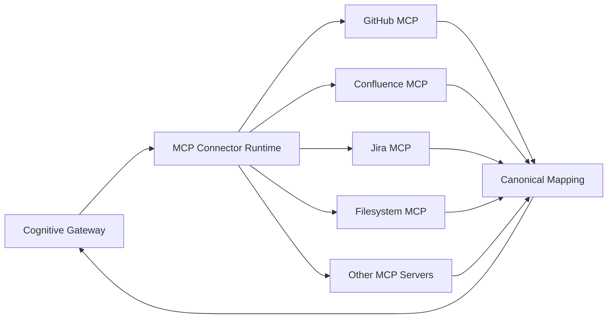

# MCP Connector and Plugin Runtime

## Status

**Planned — EPIC-07 #223.**

EPIC-07 introduces the outbound plugin architecture used to connect Cognitive Gateway to external systems without provider-specific logic entering the deterministic core.

## Principle

> MCP is the universal connector protocol. Cognitive Gateway remains the authority for planning, policy, evidence, context and execution.



## MCP owns

- transport and session lifecycle;
- protocol negotiation;
- tool/resource discovery;
- invocation transport;
- protocol-level diagnostics;
- provider/server metadata.

## Cognitive Gateway owns

- source identity and provenance normalization;
- trust, sensitivity and freshness;
- scope isolation;
- canonical capability mapping;
- read/inspect/search/mutate/admin classification;
- planning and process legality;
- authorization and consent;
- evidence sufficiency;
- context compilation;
- budgets, retry policy and audit.

Therefore:

```text
MCP tool exists != tool is authorized
MCP resource exists != resource is trusted evidence
```

## Connector normalization

Provider payloads must be translated into canonical CG source/evidence/capability contracts. Raw arbitrary provider JSON must not flow directly into planning or policy as authoritative state.

A connector result needs enough metadata to preserve connector/server identity, object identity, revision/digest, acquisition time, freshness, trust, sensitivity, provenance and diagnostics.

## Security

Credentials are outer-runtime concerns. PATs, OAuth tokens, passwords and API keys must not become Intent, Plan, Evidence, ContextFragment or model-visible values.

## Failure behavior

Connector failures are typed and bounded. In particular, a mutation whose transport outcome is uncertain must not be blindly retried unless explicit operation metadata proves retry safety.

## Reference connector

GitHub is the first planned reference connector. It must prove repository, issue, pull-request and CI evidence access through the generic runtime rather than through GitHub-specific core logic.

The implementation work is tracked by EPIC-07.01 through EPIC-07.12 (#224–#235).
