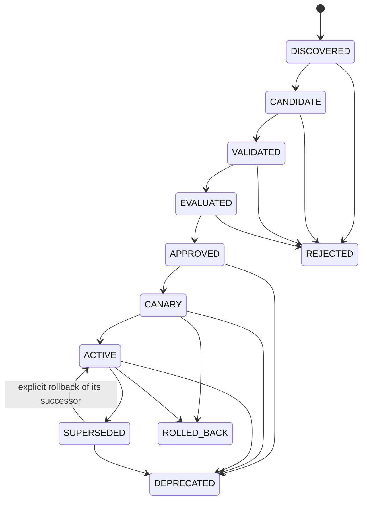

# CG-24 procedure promotion, canary and rollback

Issue [#215](https://github.com/MatthiasBurger-Coder/Cognitive-Gateway/issues/215).
The command/journal contract lives in `gateway-domain::procedure_promotion`, the
read-only projection in `gateway-registry::learned_procedures`, and the governed
command service in `gateway-application::procedure_promotion`.

## Lifecycle and evidence

Each complete immutable procedure is registered once as `DISCOVERED`. Its key is
`(id, version)` and every subsequent command additionally pins the exact digest.
Even identical duplicate registrations fail; changed content needs a new version.
The normal path is:



`Advance` handles candidate/validation/rejection edges with explicit evidence
references. Discovery validates the full procedure contract and digest. Validation
records the operator's validation evidence; `Evaluate` independently recomputes a
passing CG-23 bundle for the exact immutable version. `Approve` must reference that
retained bundle's digest. Dedicated commands enforce approval, canary, activation,
supersession, rollback and disable prerequisites. There is no generic state setter.
`REJECTED`, `DEPRECATED` and `ROLLED_BACK` cannot reactivate. A superseded predecessor
can reactivate only through rollback of its exact active successor.

CG-21's legacy `ProcedureLifecycle` remains a compatibility contract. Its draft/
suspended/retired projection neither populates nor authorizes the CG-24 registry;
there is no automatic migration or legacy fast path around canary admission.

## Authority and audit

`PromotionApplication::execute` receives a decision ID, explicit Unix time and typed
command. A trusted `PromotionAuthority` adapter authenticates the caller out of
band and authorizes that exact command. Actor and policy decision references come
from the adapter, never the request. A governor can manage promotion; a runtime
principal can only reserve executions and record outcomes. Model and worker roles
are rejected even if an adapter returns an affirmative decision. Adapters must
verify referenced external evidence, approver identity, current policy, revocations
and source freshness. Hashes and actor strings do not authenticate those facts.

Every accepted command appends its payload, unique decision ID, authenticated actor,
policy decision reference and timestamp. Times must be nonnegative and globally
nondecreasing. Replay reconstructs state from all events, revalidating procedure
content and CG-23 bundles. Duplicate decisions, invalid identities, illegal edges,
wrong evaluation bindings and altered bundles fail closed. Each entry exposes
journal indexes; supersession and rollback appear in both versions' histories.

The service owns the authority and store ports privately. Driving adapters must
keep these capabilities out of model/worker components, exposing inspection data
instead. `from_journal` is a pure read-only structural verifier: importing arbitrary
JSON there never grants live authority. Journals must originate from trusted storage.

## Canary and runtime outcomes

An approved procedure enters canary with an explicit project scope, nonempty
cohort allowlist, `[starts_at, ends_at)` time window, maximum execution count,
maximum tolerated failures and minimum verified successes. Canary must be scheduled
at or after the decision time. The scope must match the procedure fingerprint.

Before dispatch, the runtime reserves an execution with a globally unique ID, exact
procedure version, scope, cohort and mode (`CANARY` or `ACTIVE`). Reservations consume
the budget immediately. Abandoned reservations remain pending and prevent activation;
they are never silently counted as successes. Canary admission limits in-flight
executions to the remaining failure tolerance plus one, allowing an initial trial
when zero failures are tolerated. Exceeding the failure tolerance blocks further
canary admission and activation. Explicit rollback or disable then records the
operator's containment decision.

An outcome references a reservation and evidence, and can be recorded once as
success, execution failure, verification failure or refusal. Only verified successes
count toward activation; all other outcomes consume failure tolerance. Trusted
runtime adapters establish the truth of these outcomes. Outcomes are retained by
immutable procedure version, with their original execution mode. Late outcomes
remain recordable after disable, supersession or rollback without reactivation.

Activation requires the success threshold, no pending canary executions and failures
within tolerance. Completed successful canaries can activate after the sampling
window ends; new canary executions cannot. At most one version per procedure ID
is active. Runtime eligibility is distinct from permission: current process, policy,
capability, observation, evidence and verification checks remain mandatory. CG-24
records controls/outcomes. The [CG-25 reflex engine](reflex-engine.md) dispatches
ACTIVE procedures through the existing compiled Process/Policy execution boundary.

## Supersession, rollback and storage

`Supersede` requires a successful canary and an exact active older version of the
same ID. One atomic journal event changes the predecessor to `SUPERSEDED`, records
the predecessor link, and activates the successor. Historical content and evidence
remain available. Ordinary activation cannot silently replace an active version.

Rollback of an active successor requires its exact recorded predecessor, still in
`SUPERSEDED` state. It atomically restores that previously qualified active version
and marks the successor `ROLLED_BACK`. A disabled predecessor cannot be restored.
Rollback of the first active version restores the safe disabled state (no active
version). Canary rollback leaves the existing active version untouched. `Disable`
makes approved/canary/active/superseded versions `DEPRECATED`, removing the active
pointer where applicable. No operation deletes content, evidence or outcomes.

`PromotionStore` compares the expected journal revision and appends atomically. The
service validates a speculative projection before append and returns no success on
conflict. `InMemoryPromotionStore` supports local embedded use.
`gateway-daemon::procedure_promotion_store::FilePromotionStore` persists a trusted
local journal using exclusive lock creation, revision comparison, temporary-file
fsync, atomic rename and directory fsync. Reopening validates the complete journal.
It is intended for a local POSIX filesystem, with a directory writable only by the
operator service. A stale `.lock` or `.next` file after a crash fails closed and
requires operator reconciliation against the committed journal. An I/O error after
rename may have committed the event: reload and reconcile the unique decision ID
before retrying. Distributed deployments should supply a transactional store adapter.

## Inspection and reproducible checks

```sh
CG24_PROMOTION_OUTPUT=journal.json cargo test -p gateway-registry \
  --test procedure_promotion \
  versioned_supersession_and_rollback_preserve_all_evidence -- --exact
cargo run --bin cg -- procedures --registry journal.json --json
```

`cg procedures` reports every version, state, evaluation digest, canary bounds,
predecessor, active pointer, execution reservation/outcome and complete audit journal.
It supports human output, JSON, files and stdin without a model. Invalid journals
exit 3 and missing arguments exit 2. This is read-only inspection, with no CLI
self-approval or registry write mode.

Tests cover skipped/illegal transitions, malformed or wrong-version evaluation,
immutable version collisions, time/decision tampering, denied authority, bounded
canary admission, pending/failing outcomes, supersession, rollback, disabled safe
predecessors, late outcomes, transactional conflicts, durable reopen and CLI replay.
The quality gate retains `cg24-promotion.json` and `cg24-inspection.json` and requires
95% line coverage in all five production modules.
