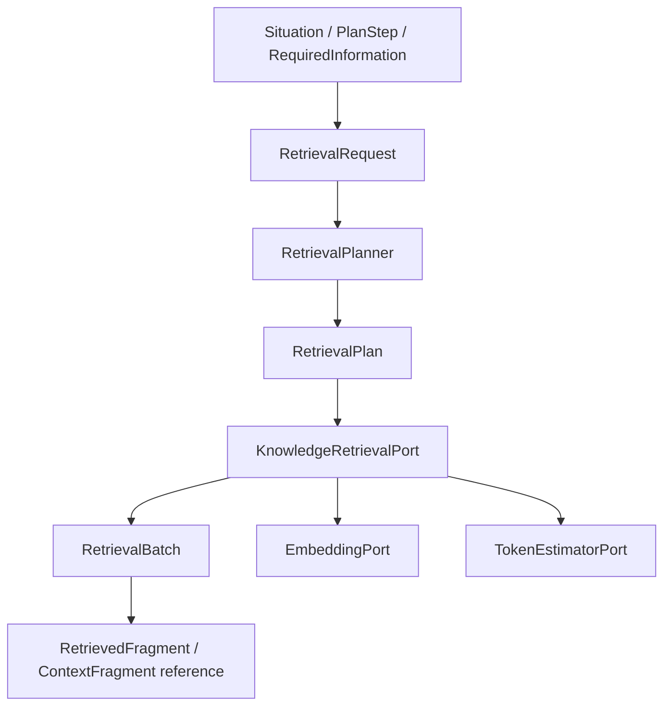

# CG-15: modular retrieval plane (IR v1)

Issue: [#174](https://github.com/MatthiasBurger-Coder/Cognitive-Gateway/issues/174).

## Ownership and flow

`gateway-domain::retrieval_plane` owns the provider-independent Rust contracts.
`gateway-application::ports::outbound` owns `RetrievalPlanner`,
`KnowledgeRetrievalPort`, `EmbeddingPort`, and `TokenEstimatorPort`.
The existing `KnowledgePort` remains available for existing CG-01/CG-10 consumers.
No adapter, database client, tokenizer, embedding implementation, or recursive
retrieval executor is introduced here.



`RetrievalRequestInput` is a draft. `RetrievalRequest::new` validates it and sorts
source/strategy selections. `RetrievalPlan::new` checks explicit adapter support
and retains the entire immutable request. The plan has an opaque
`RetrievalPlanId` and `RetrievalVersion`; request and result envelopes also carry
that version. V1 is the only accepted version. Changes to interpretation require
an explicit version change; availability never creates a different plan.
These are Rust contracts, not a new JSON protocol. Future wire adapters must
reject unknown fields/versions and use these validated construction boundaries.

## Required information and isolation

Every request has a `ContextScopeId` and initiating `ProvenanceId`; optional
`SituationId` and `PlanStepId` link the request to its consumer. Purpose is typed:
architecture evidence, task knowledge, memory recall, or state observation.
Queries retain their exact nonempty text. `RequiredInformation` reuses
`InformationRequirements` for freshness, evidence/provenance references and
minimum sensitivity handling, plus an explicit set of accepted `TrustClass`
values and a maximum permitted `SensitivityClass`.
Trust classes are membership labels, not an ordinal trust hierarchy.

A `RetrievedFragment` contains content, a compatible `ReferenceId`, scope,
existing CG-06 `Provenance`, required source snapshot `ContentDigest`,
`QualityMetadata`, and evidence IDs. Evidence IDs are references to records
validated by the owning evidence boundary; retrieval cannot manufacture evidence
validity. Freshness requirements consume the owning quality assessment. Adapters
must compute that assessment using the existing freshness policy and an explicit
evaluation time. The retrieval IR does not read a clock or verify source truth.

`RetrievalBatch::new` checks plan identity, scope, round, accounting, selected
sources/strategies, quality requirements, result explanations, and terminal
status consistency. The resulting envelope cannot be mutated. Failed and empty
batches still carry scope and plan identity; the plan resolves request provenance.
The contained results inherit the envelope version and plan/round lineage.

Project paths/configuration remain adapter inputs resolved through the request
scope. They never become Gateway catalog entries. A digest identifies the source
snapshot; it need not be the digest of the individual fragment text.

## Sources, strategies, and deterministic order

| Contract | V1 classes |
| --- | --- |
| Source kind | Document, VectorIndex, Graph, Memory |
| Strategy kind | Lexical, Semantic, GraphTraversal, MemoryRecall |

Opaque `RetrievalSourceId` and `RetrievalStrategyId` allow multiple implementations
without provider types. `RetrievalSupport` identifies supported ID/kind pairs;
unsupported selections fail explicitly, including unsupported optional services.
An optional service is supported but may be unavailable at execution time.
New implementations use existing kinds; new kinds require a reviewed contract
extension. String conversions reject unrecognized kinds.

Queries and trust classes have set semantics. Source and strategy vectors sort
by ascending priority then ID; duplicate IDs are rejected even if their other
metadata differs. Priority is semantic and is never discarded. Each selected
source/strategy is eligible for the explicit plan; adapters must not introduce
additional IDs or silently substitute services. Plan explanations record the
explicit selections and required-information rationale.

Result relevance is an integer in `[0, 1_000_000]` representing millionths on a
common relevance scale. Adapters must normalize native scores to that scale;
raw distances are not interchangeable with it. Results sort by descending score,
then source ID, strategy ID, and fragment ID. Duplicate fragment IDs are rejected.
Explanation records sort by typed target, selection, reason, and detail.
Equivalent explicit inputs therefore yield equal Rust aggregates regardless of
input arrival order. No availability probing is part of canonicalization.

## Budgets and stopping

All limits are explicit, unsigned and finite. Results, rounds and elapsed
milliseconds use nonzero integers; there is no omitted/unlimited state. Zero
cost/token limits permit no consumption in that dimension.

| Budget | Meaning |
| --- | --- |
| ResultBudget | Cumulative accepted result count |
| RoundBudget | Total rounds, including attempts/retries |
| LatencyBudget | End-to-end milliseconds, including waiting/retries |
| CostBudget | Integer maximum and explicit accounting unit definition |
| TokenBudget | Cumulative retrieval input/output/embedding token allowance |
| ContextBudget | Total context tokens and disjoint semantic reservations |

`BudgetUsage` records cumulative counts in the same cost unit. Checked addition
rejects integer overflow and differing units. Context usage is a retained-context
snapshot, so `checked_add` replaces that map rather than accumulating it.
`validate` rejects every overrun. Adapter/executor code must also enforce
monotonic cumulative counters between rounds and reserve a conservative upper
bound before dispatch, including any concurrent work. Constructor validation is
not a scheduler or a cancellation mechanism.

A batch contains the cumulative accepted selection through its reported round;
usage may exceed the number of retained results, but must never be smaller.
This permits distinct evidence counting across rounds and explicit accounting
for results removed by later selection. The reported round equals usage rounds.

The mandatory `StopCondition` is either `BudgetExhausted` or
`EvidenceSatisfied(nonzero count)`. Every hard limit applies to both. Evidence
completion counts distinct accepted evidence IDs; repeated fragments cannot
increase that count for the same evidence. `should_stop` checks cumulative hard
limits and evidence completion. Exhausted context reservations reject insertion
through `ContextBudget::validate_usage`; the executor must stop rather than
borrow reserved space or dispatch work whose upper bound cannot fit.

### Context reservations

The total is separate from the reservation map. Supported classes are
`AuthorityReserved`, `TaskReserved`, `OutputContractReserved`, `Evidence`,
`Knowledge`, `Memory`, `RuntimeState`, and `SafetyMargin`.

Reservations are disjoint caps that protect each class from the others. Their
checked sum cannot exceed the total. A missing class has capacity zero;
unallocated tokens are unavailable; no implicit borrowing occurs. The safety
margin is kept unused by the assembler. Reservation labels confer no authority
and do not allow retrieval to create authority fragments. CG-20B will own
selection, redistribution policies and compaction.

## Explainability and failure semantics

`RetrievalExplanation` identifies a source, strategy, result, or optional CG-16
reranker, whether it was
selected, a stable `RetrievalReason` variant, and a nonempty explanation. V1
reason names are fixed Rust codes: `ExplicitSelection`, `Relevant`,
`TrustRejected`, `FreshnessRejected`, `SensitivityRejected`, `Duplicate`,
`BudgetReached`, `EvidenceSatisfied`, `NoMatches`, `ServiceUnavailable`,
`Unsupported`. Every accepted result requires a `Relevant` selection record.
Rejected candidates can retain their IDs in explanation records without content.

| Status | Allowed reason / behavior |
| --- | --- |
| Complete | EvidenceSatisfied, NoMatches, or BudgetReached |
| Partial | BudgetReached; accepted subset retained |
| Degraded | ServiceUnavailable; names an unavailable optional source, strategy or reranker |
| Failed | ServiceUnavailable or Unsupported; no accepted results |

BudgetReached requires a hard limit to be reached; EvidenceSatisfied requires
the distinct evidence threshold; NoMatches requires an empty result set.
A pre-dispatch inability to reserve sufficient resources may instead return the
stable `BudgetExceeded` error. Optional semantic unavailability is visible as
Degraded; a required service must fail. The same plan is retained in either case.
`RetrievalError` codes distinguish unsupported versions/sources/strategies,
malformed plans/budgets, overflow, exhausted budgets, duplicate identities,
scope mismatches, malformed results, embedding incompatibility, stale indexes, invalid token
estimates and service unavailability. Errors contain no raw source content.

## Embedding and token estimation

`EmbeddingRequest` includes explicit scope, source fragments and either an exact
`EmbeddingModel` requirement or explicit adapter selection with a required
dimension. A model identity contains `EmbeddingModelId`,
`EmbeddingModelVersion`, optional digest and nonzero dimension. An
`EmbeddingResult` validates one finite `Vec<f32>` for every requested fragment
and retains the complete source snapshot/provenance lineage. Results are sorted
by fragment ID. There is no provider SDK type or model implementation.

`EmbeddingIndexMetadata::ensure_compatible` requires identical scope, model ID,
version, digest (including presence), and dimension. Index writers must use it
before merging vectors. A changed model identity requires a new partition or
re-embedding; changed source snapshot lineage requires invalidation/re-embedding.
Vectors and indexes are always derived information and cannot grant capabilities
or register catalog definitions.

`TokenEstimateRequest` carries scoped fragments and optional target metadata.
`TokenEstimate` identifies the estimator and its version. `TokenCount` is:

- `Exact`: a count plus explicit target runtime/model identity;
- `Estimated`: a count, optional conservative upper bound, and approximation semantics;
- `Unknown`: an explicit reason, without a fabricated count.

Exact counts refer to the tokenizer/version used for that target; callers must
check the returned target against the intended runtime. `budget_bound` accepts
exact counts or an estimate's upper bound when it is at least the estimate.
Unknown, unbounded and inconsistent estimates fail for hard budget accounting.

## Authority boundary and context integration

These records have no capability grants, policy decisions, process transitions,
or Agent/Skill/Process registration fields. Imperative retrieved text remains
content. Source trust and model output cannot mutate authority.
CG-10 continues to own `ContextFragment` and its external-kind/trust validation.
Consumers can use the fragment's `ReferenceId` to resolve a context fragment, or
map its content/metadata through the existing external constructor; they must
retain scope, snapshot provenance and sensitivity. Retrieval does not depend on
`gateway-context` or duplicate its assembly logic.

## Verification

`crates/gateway-domain/tests/retrieval_plane.rs` covers version rejection,
canonicalization, ordering, every budget dimension, overflow, mandatory stop
conditions, invalid/degraded results, quality/scope checks, embedding lineage
and incompatibility, and exact/estimated/unknown token semantics.

```sh
cargo test --workspace --locked
cargo clippy --workspace --all-targets -- -D warnings
./scripts/check-architecture.sh
cargo llvm-cov -p gateway-domain --all-targets --json --output-path target/cg15-coverage.json
python3 scripts/check-retrieval-coverage.py --self-test
python3 scripts/check-retrieval-coverage.py target/cg15-coverage.json
```

The repository quality gate requires at least 95% measured line coverage in
every CG-15 production module; missing or duplicate coverage records fail.
