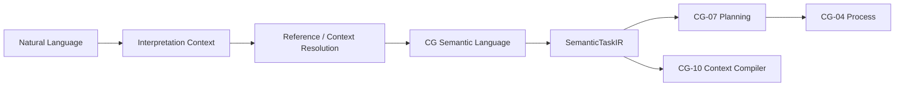

# CGSL, SemanticTaskIR and Natural-Language Interpretation

## Status

**Planned architecture — EPIC-05 #177.**

The current deterministic core can consume structured task/context contracts, but Cognitive Gateway does not yet provide the complete natural-language-to-`SemanticTaskIR` compiler described here.

## Purpose

The normative [CGSL scope and canonical vocabulary](cgsl-scope-and-vocabulary.md)
defines the EPIC-05.01 semantic baseline, construct ownership, validation
responsibilities and domain boundaries. Grammar and runtime implementation
remain separate planned slices. The [SemanticTaskIR v1 contract](semantic-task-ir-v1.md)
now supplies Rust types, canonical JSON, invariants and versioning under #180.
The [Interpretation Context specification](interpretation-context.md) defines
request identity, typed relevance, seven-tier precedence, conflicts and lifecycle
under #181. Its production assembly/resolution remains planned.

CGSL and `SemanticTaskIR` form the semantic boundary between ambiguous human language and deterministic planning/execution.

The governing rule is:

> Natural language may express intent. Resolved Cognitive Gateway semantics must express unambiguous meaning.

## Separation of responsibilities

### CGSL / SemanticTaskIR

Describes **what the task means**: goal, target, input, state, desired state, evidence, assumptions, constraints, required capabilities, output and verification contracts.

### Process IR / Strict Cognitive Gherkin

Describes **how controlled execution proceeds**: activities, legal transitions, readiness and process lifecycle.

### Prompt / Execution rendering

Describes **how a selected runtime/provider receives the already constrained task**. Provider prompts, templates, sampling configuration and model-specific options do not belong in CGSL.

## Interpretation flow

1. Accept natural-language input.
2. Assemble only relevant request-scoped interpretation context.
3. Resolve entities and references using explicit precedence.
4. Represent unresolved, ambiguous or conflicting fields explicitly.
5. Request clarification or additional evidence when mandatory semantics cannot be resolved.
6. Compile valid semantics into canonical `SemanticTaskIR`.
7. Hand the validated IR to existing planning/resolution/context boundaries.

A model or SLM may assist steps 2–4 by proposing candidates, but the canonical result must pass deterministic schema and semantic validation.

## Required epistemic separation

The semantic layer preserves the difference between:

- fact;
- observation;
- evidence;
- inference;
- hypothesis;
- assumption;
- unresolved knowledge gap.

A hypothesis cannot silently become a fact, and a model-generated value cannot silently become verified evidence.

## Current implementation boundary

As of 2026-10-11:

- the architecture and work breakdown are defined in EPIC-05;
- the [SemanticTaskIR v1 Rust/wire contract](semantic-task-ir-v1.md), invariants, versioning and reference fixtures are implemented under #180;
- the [Interpretation Context contract](interpretation-context.md), deterministic precedence and lifecycle are specified under #181; runtime resolution remains planned;
- Rust parser/compiler work is planned under EPIC-05.08 #186;
- integration with CG-06/07/08 is planned under EPIC-05.12 #190;
- the Process IR boundary is planned under EPIC-05.13 #191;
- Prompt IR handoff is planned under EPIC-05.14 #192;
- conformance and adversarial qualification are planned under EPIC-05.15 #193;
- complete language/arc42 documentation is planned under EPIC-05.16 #194.

Until this vertical slice exists, callers that need deterministic execution must supply the required structured contracts through existing interfaces instead of assuming free natural-language compilation is available.
