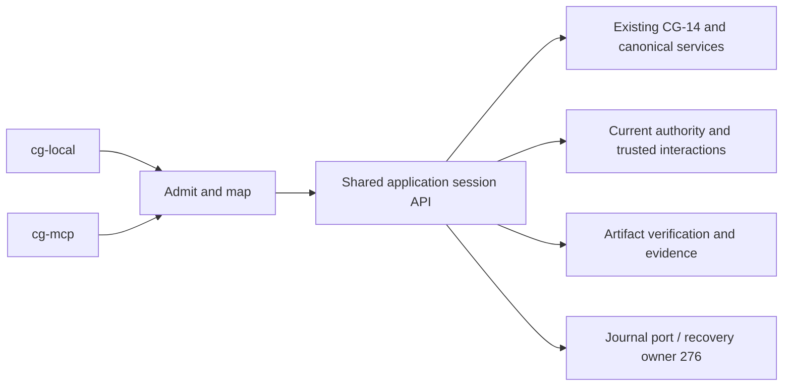

# Shared session contracts and Codex binding — EPIC-04.12

Date: 2026-10-10. Contract decision: **READY_FOR_WORKFLOW** for #272 contract
implementation. Runtime status: **NOT_IMPLEMENTED**. ADR-021 records the decision.
This is a normative application API specification, not a delivered Rust trait,
coordinator, persistence adapter or passing session qualification.

Owners: [#272 contracts](https://github.com/MatthiasBurger-Coder/Cognitive-Gateway/issues/272),
[#273 coordinator](https://github.com/MatthiasBurger-Coder/Cognitive-Gateway/issues/273),
[#275 interactions](https://github.com/MatthiasBurger-Coder/Cognitive-Gateway/issues/275),
[#276 recovery](https://github.com/MatthiasBurger-Coder/Cognitive-Gateway/issues/276),
[#277 budgets](https://github.com/MatthiasBurger-Coder/Cognitive-Gateway/issues/277).
[#293](https://github.com/MatthiasBurger-Coder/Cognitive-Gateway/issues/293)
defines this binding; [#294](https://github.com/MatthiasBurger-Coder/Cognitive-Gateway/issues/294)
implements it after those gates. [#297](https://github.com/MatthiasBurger-Coder/Cognitive-Gateway/issues/297)
provides the planning gate. Consumers include
[#274 invocation](https://github.com/MatthiasBurger-Coder/Cognitive-Gateway/issues/274)
and [#279 system qualification](https://github.com/MatthiasBurger-Coder/Cognitive-Gateway/issues/279).

## Supported task and completion boundary

The user selected **a verified context artifact as the explicit goal** on
2026-10-10. The first supported structured Intent requests compilation of one
ExecutionContextIR for an admitted, pinned plan step, projection and source set.
Its acceptance conditions require the artifact's canonical validation, exact
input/step/scope linkage, digest, provenance, sensitivity/disclosure checks and
current Process/Policy approval. The host must register this exact supported
Intent shape and reject other desired states before creating a session.
`cg.intent` still means the existing domain Intent; it is never a generic task
wrapper or an instruction to treat arbitrary DesiredState as compiled context.
#272 defines the typed supported-goal validator; #273 implements it and its
artifact observations. Concrete fixtures and executable validation are their gate.

The artifact source is `ContextApplication::compile_step` / `CompiledStep`,
produced from admitted inputs by CG. The trusted observation source is the
#273 artifact verifier: it loads the stored canonical artifact, recomputes its
digest, validates its contract and basis against the persisted goal, and captures
scoped observations/evidence through the existing observation admission boundary.
It must be independent of client/model assertions; an outer storage adapter
supplies bytes, while application validation supplies the verdict. Compilation
success alone does not provide this verification. No fabricated fixture fact,
returned JSON projection or model statement substitutes for the verifier.

Complete only after CG-14 evaluates those admitted observations against the
exact Intent, and an immutable scoped evidence record links the artifact,
verified goal/basis and validation receipt. The final reference denotes evidence,
not an execution grant. If initial observations already satisfy the goal, #273
must still verify the referenced artifact before completing. A missing verifier
or evidence store means unsupported capability; no completed session is projected.
Execution of a different domain desired state, semantic interpretation, model
inference and external connectors remain unsupported in this baseline. Their
owners remain EPIC-05/06/07 and #274, respectively.

## Existing services and ownership

| Existing baseline | Shared use / limit |
| --- | --- |
| `Intent`, `DesiredState`, scoped observation admission | Strict structured goal, acceptance/constraints and authenticated facts; no semantic parsing |
| `DeclarativeSituationApplication`, `DeclarativePlanningApplication` | Situation assessment, Delta and deterministic plan; no second planner |
| `DeclarativeResolutionApplication`, `ResolvedPlan`, snapshot/composition ports | Pinned capability/process closure, resolution and explanation |
| `PolicyApplication`, `PolicyEngine`, `PolicyAuthority`, `StepFacts` | Current authorization, evidence, consent and process gate; capability-level consent facts alone do not prove exact action consent |
| `ContextApplication::compile_step`, `CompiledStep` | Canonical context artifact production, disclosure and validated IR |
| `ClosedLoop`, `VerifiedOutcomeReceipt` | Continue/Replan/Pause/Success/Stopped decisions and verified outcome evaluation; no durable session/recovery API exists |

The application owns one session service used by CLI and Codex. The daemon
composition root injects current authority, input admission, artifact storage,
verification, interaction authority and journal ports. Adapters translate commands
and disclose results. `CodexHost::session` is currently an unsupported `Value`
projection hook, not the shared typed API. #272 owns the typed API; #273 owns its
execution. Neither MCP connection lifetime nor Codex approvals own CG lifecycle.



## Typed command/query specification

The following Rust-shaped notation specifies types to implement in #272; it is
not compiled code or permission to expose operations. Opaque IDs are distinct
newtypes with the frozen ASCII token validation. Revision is an integer in
`0..=9007199254740991`; overflow refuses a transition, never wraps.

```rust
struct OwnerBinding { principal: PrincipalId, workspace: WorkspaceId,
    project: ProjectId, binding: BindingId, client_owner: ClientOwnerId }
struct CommandKey { owner: OwnerBinding, command: CommandId }
struct RequestedExecution { mode: OperatingMode, profile: ExecutionProfile }
struct Mutation { session: SessionId, command: CommandId,
    expected_revision: Revision }
enum SessionCommand {
    Start { command: CommandId, intent: Intent, execution: RequestedExecution },
    Clarify { at: Mutation, pending: PendingId, answer: ClarificationAnswer },
    Approve { at: Mutation, pending: PendingId, consent: ConsentRecordRef },
    Continue { at: Mutation },
    Cancel { at: Mutation },
}
enum InspectTarget { Session(SessionId), Command(CommandId) }
struct InspectSession { target: InspectTarget }
// execute(authenticated_owner, command) -> Result<SessionSnapshot, SessionError>
// inspect(authenticated_owner, query) -> Result<SessionSnapshot, SessionError>
```

`authenticated_owner` is a host-authenticated value, supplied separately from
client DTOs. Start resolves its Intent and captures trusted snapshots through
ports. Clients cannot populate authority, observations, verifier receipts or
journal events. `ClarificationAnswer` is the exact registered typed answer
contract requested by the stored question, not arbitrary JSON. `ConsentRecordRef`
is a pinned identity/version/revision/digest loaded from the trusted consent
store, never a client-created grant. These private validated types must not have
an unchecked client-deserialization path.

`SessionSnapshot` contains task SessionId, immutable OwnerBinding (internally),
RunId, Revision, state, pending references, dispatch outcome knowledge, accepted
command outcome and optional verified final evidence. Public projections disclose
only admitted metadata. Command inspection returns the session created/changed
by a committed command, its committed revision/outcome and the currently
authorized snapshot; an absent command returns unavailable. This
also recovers a lost start response without allocating a second task. Inspect
never resumes work, polls an external effect or changes revision.

Transport connection, client-owner admission, SessionId, RunId, CommandId,
DispatchId and PendingId are different identities. Reconnection may change the
connection ID, but must reauthenticate the same stable owner binding. A new
binding/client owner cannot seize the session; owner transfer is unsupported.
RunId is allocated once for this baseline; replans preserve it and budgets.
DispatchId identifies one compiled invocation and its correlated outcome.
Request/trace IDs and authority mapping revisions are neither command keys nor
session identities. Session owner/goal never changes after start. Requested mode
and profile are validated domain enums, persisted with the goal and bounded by
current authority. They never elevate authority or reset budgets; later command
envelopes must match the persisted selection or fail validation.

## Revisions, replay and lifecycle

Command identity is `(OwnerBinding, CommandId)` across the owner's sessions,
including start. Atomic journal acceptance prevents a reused ID creating another
session. Any committed duplicate is refused even with identical payload; changed
payload under the same ID is also refused. Concurrent identical starts yield at
most one session. Rejected commands do not consume IDs or mutate session state;
a corrected command may be submitted, but it must satisfy current revision and
authority. Command retention lasts for the supported continuation lifetime;
a retained session cannot outlive its command ledger.

Start commits revision 1, immutable scope/goal, RunId, initial assessment and its
command outcome before acknowledging. All accepted commands and autonomous
application events (outcome ingestion, expiry, withdrawal, recovery decision)
advance revision once per atomic transition. Rejection does not advance it.
Terminal state/revision is immutable; later revocation can be retained in the
authority audit without reopening or revising the task. Each existing-session
mutation compares expected revision atomically; two writers
cannot accept the same predecessor revision. Persist command outcome and state
in the same transaction. Ambiguous commit means outcome unknown: inspect by
command/session, never automatically replay a possible mutation.

| State | Admitted transition / rule |
| --- | --- |
| runnable | Continue may reserve one eligible dispatch after fresh checks; Cancel may terminate if no invocation is outstanding |
| dispatching | Only correlated outcome/reconciliation or cancellation request; no second Continue dispatch |
| pending_clarification | Clarify consumes the exact question once, records validated answer and reassessment, then becomes runnable or genuinely pending again; Continue is blocked |
| pending_consent | Approve consumes the exact request after trusted-record validation, then becomes runnable; Continue is blocked |
| cancelling | No new dispatch; wait for acknowledged stop or outcome reconciliation |
| outcome_unknown | Inspect discloses uncertainty; no dispatch/retry/completion/confirmed cancellation until #276 reconciles it |
| completed / failed / cancelled | Immutable terminal outcome; Inspect only; mutations including another Cancel refuse; Start always creates a separate task with a fresh command |

Continue may transition directly to a real pending interaction, failed or completed
state if existing services establish that outcome; it must not invent a dispatch.
A prerequisite with no supported actionable question/action remains blocked with
a diagnostic, not a synthetic pause. CG-14 decisions remain authoritative; wrapper
states describe orchestration and outstanding effects, not another process engine.
Completed requires verified evidence and no pending/uncertain dispatch. Cancelled
requires no unresolved effect; cancellation does not undo an already completed
effect. Failed does not conceal an uncertain effect. Terminal snapshots retain
history but have no actionable pending entries.

Admission order is bounded decode/version/type, current authenticated owner/scope,
owner-scoped lookup, command replay, revision, state/pending/expiry, canonical
validation, current authority and dispatch checks. Wrong owner uses scope-denied
without revealing existence. Reads also apply current disclosure policy. Stable
application reasons include duplicate, stale revision, invalid state, invalid or
expired interaction, consent required, authority denied, limit exceeded and
outcome unknown; v2 publishes fixed sanitized diagnostics before release.

## Trusted clarification and consent

#275 application logic creates a question only from a supported structured-input
validator and an actual missing admitted input/source selection. It stores
PendingId, SessionId/RunId, owner, issued revision, typed answer parser/version,
question/source basis digest, expiry and consumption state. In the baseline,
answers can select an admitted source or provide validated non-authority task
parameters. Facts requiring source authentication still pass observation admission.
The answer cannot change the immutable goal or grant mutation consent. EPIC-05
clarification plans require that epic's trusted compiler/validator and remain
unsupported here. Client/model-authored question plans are proposals only.

Consent requests are created by #275 from current CG policy and the exact
compiled action: capability closure, step, DispatchId reservation, canonical
argument digest, artifact/basis digest, authority/process/catalog fingerprints,
owner, task/run, pending ID, issued revision and expiry. Canonical arguments use
the registered action serializer and include all effect-relevant defaults; raw
JSON hashing or scope-free capability consent is insufficient. Never display a
request as an approval record. The trusted CG consent authority owns issuance,
denial and withdrawal, authenticated issuer and live revocation checks. Its
verified record must bind that complete tuple and its own pinned version/digest.
The store and issuer are #275 prerequisites, not an implemented CG grant service.

Approve requires expected revision to equal the pending issuance revision and
the record's bound revision. Acceptance persists the consumed request, record
reference and accepted revision atomically; it advances the session revision.
Continue uses that newer revision but the grant stays bound to the original
pending revision and unchanged action/basis. Merely incrementing revision for
approval does not invalidate its own grant. A changed action, arguments, basis,
owner, relevant authority or expired/revoked record invalidates it and requires
a new request, not rebinding old consent. It is valid for at most the reserved
dispatch. Current policy, scope, disclosure, expiry and revocation must be checked
again immediately before invocation, under fencing/current-authority validation.
If the authority cannot provide a valid current check, do not dispatch.

Trusted time determines expiry; `now >= expires_at` is expired. An expired reply
is refused without mutation. The application's expiry event retires the request
and advances revision; a replacement has a new PendingId and issuance revision.
Basis changes retire old questions/actions. Denial/withdrawal comes from the
trusted authority and is durably recorded even if no client is connected. It
blocks further dispatch. Denial retires the request and records a failed task
when no dispatch is outstanding. Withdrawal before dispatch invalidates the
accepted grant; current policy determines whether a fresh consent request is
allowed or the task must fail. A withdrawal during an invocation records revocation
and requests cooperative stop without pretending the effect was rolled back.
Codex approval UI/settings, a boolean answer or a `cg.consent-record` client
document never mint a CG grant. Persist secrets as authorized references only.

## Disconnect, continuation and recovery

EOF, connection loss, call timeout or MCP invocation cancellation stops waiting
for that call; it neither cancels the task nor resets limits or accepts an
interaction. Only an admitted Cancel command requests session cancellation.
A lost mutation response returns outcome-unknown where transport permits;
otherwise the reconnecting client must inspect before another mutation.
Reconnection reauthenticates the same stable owner, loads current scope/policy,
checks current disclosure and obtains current revision. It does not automatically
resume or replay work. Continue then revalidates inputs, process/catalog/policy,
consent/revocation and remaining cumulative budgets.

Minimum durable state: versioned goal and immutable owner/run; command ledger
and outcomes; revisions/lifecycle; admitted input identities/digests/provenance;
process/catalog/policy fingerprints; full pending payload/parser/expiry/consumption;
consent record and denial/withdrawal; consumed budgets and absolute deadline;
dispatch reservation/intent/fencing/correlation; outcomes, cancellation and
verification/evidence references. Acknowledgement follows durable atomic commit.
Dispatch intent and consumed budget commit before invocation; correlated outcome
commits afterwards. No claim of external exactly-once execution is made.

#276 owns checkpoint/event format, migration/corruption validation, PostgreSQL
adapter, single-owner fencing and reconciliation. Unknown/unconfirmed invocation
enters outcome_unknown after restart; only supported read-back/correlation can
resolve it, never blind retry. `ClosedLoop::to_json()` is a redacted diagnostic,
not a checkpoint. #277 owns cumulative resource/deadline accounting, including
nested calls; counters cannot reset on reconnect/replan/restart. Without these
gates, durable continuation is unsupported and must not be advertised. Storage
failure/conflict cannot acknowledge acceptance or release an effect.

Normative outbound port responsibilities (implemented under their owners):
`CurrentAuthorityPort` loads/revalidates admitted scope, authority and revocation;
`InteractionAuthorityPort` issues/loads typed requests and verified records;
`ArtifactVerificationPort` loads and verifies admitted canonical artifacts;
`SessionJournalPort` loads a validated session or owner-scoped command outcome,
atomically creates a session with a unique CommandKey, and conditionally appends
an event batch against expected revision and fencing token. Append commits state,
command outcome, budget consumption and any dispatch reservation together.
A stale revision, stale fence or duplicate key refuses the whole batch. #276 owns
concrete checkpoint/event serialization and adapter implementation; #272 defines
these provider-neutral port types. No storage technology enters the core API.

## Frozen v1 compatibility and explicit v2 decision

No files in `schemas/codex/v1` or its fixtures change. Existing v1 session calls
remain `unsupported / CG_UNSUPPORTED_CAPABILITY`. Existing canonical one-shot
operations retain their exact v1 mapping. No runtime can silently enable the new
contract by accepting old envelopes with new meanings.

| Frozen v1 | Shared contract / explicit boundary decision |
| --- | --- |
| start: command_id + cg.intent document/reference | Same domain Intent meaning; v2 validates the explicit artifact goal; authenticated inputs loaded internally |
| inspect: session_id only | v2 inspect selects exactly one session_id or owner-scoped command_id, enabling lost-start outcome inspection |
| clarify: session/command/expected_revision/pending + cg.clarification | v1 defines wrapper only, no registered structured parser; v2 publishes separate clarification-request and typed-answer contracts, preserving admission |
| approve: same mutation fields + pinned cg.consent-record | Approval remains a trusted reference; v2 publishes the exact verified consent payload and separate consent-request contract |
| continue / cancel: session/command/expected_revision | Same intent, with richer explicitly versioned state/uncertainty projection |
| pending consent reference uses cg.consent-record | Cannot silently treat a pending request as a verified grant; v2 uses a distinct consent-request discriminator |
| result: running/pending_clarification/pending_consent/completed/cancelled/failed; no run/dispatch fields | v2 publishes the states above, RunId and dispatch outcome knowledge; no lossy translation of uncertainty to running/failed |
| completed requires pinned cg.evidence final reference | Preserve evidence requirement; v2 evidence parser explicitly binds artifact, goal and verification receipt |
| schema_version 1.0, strict unknown fields / fixed diagnostics | New session boundary is major version 2.0; unknown versions stay refused, no implicit downgrade |

#272 owns shared types and payload parsers. #293 specifies these changes; #294
must publish immutable `schemas/codex/v2` request/response/common/catalog artifacts,
fixtures, exact version/tool/resource routing and sanitized reason mappings before
exposure. v2 session tools use `cg_session_<command>_v2`; their envelopes explicitly
state `2.0`. v1 tools/resources remain unchanged. Discovery advertises only enabled
exact versions; negotiation does not turn unsupported owners into services.
This document does not publish or claim an executable v2 endpoint. MCP protocol
date and application envelope version remain independent.

## Requirement and delivery gate matrix

Four review perspectives were applied as sequential role passes by one agent,
not independent approval: requirements (explicit artifact goal), architecture
(one coordinator and exact authority), automation (Rust API/daemon injection,
frozen schema routing), testing (contract vs service vs installed path).

| ID / #293 requirement | Contract evidence (VERIFIED by role review) | Implementation owner / prerequisite gate | Execution evidence status (BLOCKED) |
| --- | --- | --- | --- |
| SC-01 ADR, typed API and immutable identities | ADR-021; typed commands/query and owner sections | #272 typed validation/concurrent start/owner negatives; #273 shared coordinator | NOT_RUN; services absent |
| SC-02 revision/replay/terminal/interaction/expiry/consent | Lifecycle table and trusted-interaction tuple/approval revision rule | #272 stale/replay/terminal gate; #275 one-use, expiry, changed action/arguments/authority and withdrawal gate | NOT_RUN |
| SC-03 baseline and unsupported capabilities | Explicit artifact goal/verifier; existing services table | #273 real artifact observations and CG-14 verified completion; EPIC-05/06/07 remain unsupported | Canonical services exist; session proof NOT_RUN |
| SC-04 trusted plans/answers and CG consent | Private validated types, question/consent issuer and normal admission | #275 trusted issuer/store and source validation; semantic plan needs #188, excluded from baseline | NOT_RUN |
| SC-05 disconnect/reconnect/current authority/persistence | Recovery section and uncertainty/cancellation rules | #276 crash/fencing/corruption/read-back gate (depends #272/#273/#274/#275); #277 budgets/deadline gate | NOT_RUN |
| SC-06 frozen v1 comparison / versioned change | Exact mapping table, unchanged v1 and explicit v2 scope | #294 strict v2 schemas/parser/fixtures/routing and backward compatibility gate | Existing v1 checks apply; v2 NOT_IMPLEMENTED |
| SC-07 evidence levels and linked prerequisites | This matrix and ordered gates below; #297 planning evidence | #294 shipped host; #295 installed client; #296 full parent reconciliation; #279 system scope | Session qualification NOT_RUN; EPIC-04 NOT_COMPLETE |

Order: accepted specification -> #272 typed contract/fixture gate -> #273 and
#275 service gates -> #274 supported invocation boundary / #276 recovery gate ->
#277 cumulative limits -> #294 production binding and v2 publication -> #295
installed-client lifecycle qualification -> #296 full-parent acceptance. #276
implements storage/recovery; this slice does not take that ownership. Semantic
#188 is not required for structured questions, but remains required before its
plans can be exposed. No consumer readiness is inferred from this contract's
completion. #273 artifact verifier is included prerequisite work, not an assumed
available adapter.

Required service scenarios: supported start/inspect/command-outcome lookup;
validated real clarification and trusted consent pauses; single dispatch and
artifact verification; changed policy/arguments/withdrawal; wrong owner/scope;
duplicate/stale/expired interactions; cancellation before/during effect; lost
start/continue response; EOF/reconnect; restart with pending interactions and
consumed budgets; conflicting owners; corrupt/incompatible journal; uncertain
effect. Then exercise shipped CLI/MCP composition roots and installed Codex.
ProjectionHost fixtures prove shapes only. >=95% changed-production-file coverage
and existing architecture/quality gates remain applicable to implementation.

Rollback retains unsupported session operations. Reverting this specification
changes no runtime/storage state. Contract completion does not close #272/#273/
#275/#276/#277/#294 or declare EPIC-04 complete.


## Retained contract verification — 2026-10-10

Candidate: documentation-only working tree based on `07cfda4`; no production
code, published schema or fixture changed. Executed checks:

| Check | Result / evidence level |
| --- | --- |
| `python3 -m unittest discover -s tests/contracts -p 'test_*.py'` | PASS, 12 tests; CONTRACT, frozen v1 fixtures and strict compatibility |
| `cargo test -p gateway-daemon --test codex_contracts --locked` | PASS, 2 tests; CONTRACT, domain execution enums and canonical assessment preservation |
| `bash scripts/check-architecture.sh` | PASS, Cargo dependency and architecture guards |
| `python3 -m unittest discover -s tests/architecture -p 'test_*.py'` | PASS, 19 tests; qualification/gate regression checks |
| Relative Markdown link existence and `git diff --check` | PASS, documentation integrity |

The full release/coverage gate was not run for this documentation-only change.
These checks establish unchanged v1 compatibility and repository integrity;
they do not execute the specified shared API, v2 schemas, artifact verifier,
trusted interaction service or restart recovery. Those remain BLOCKED/NOT_RUN
at SHARED_SERVICE, EXECUTABLE and INSTALLED_CLIENT session evidence levels.
All seven #293 contract criteria are documented and reviewed; runtime criteria
remain assigned to the prerequisite owners above. No issue/epic closure or
independent reviewer approval is inferred from this record.
